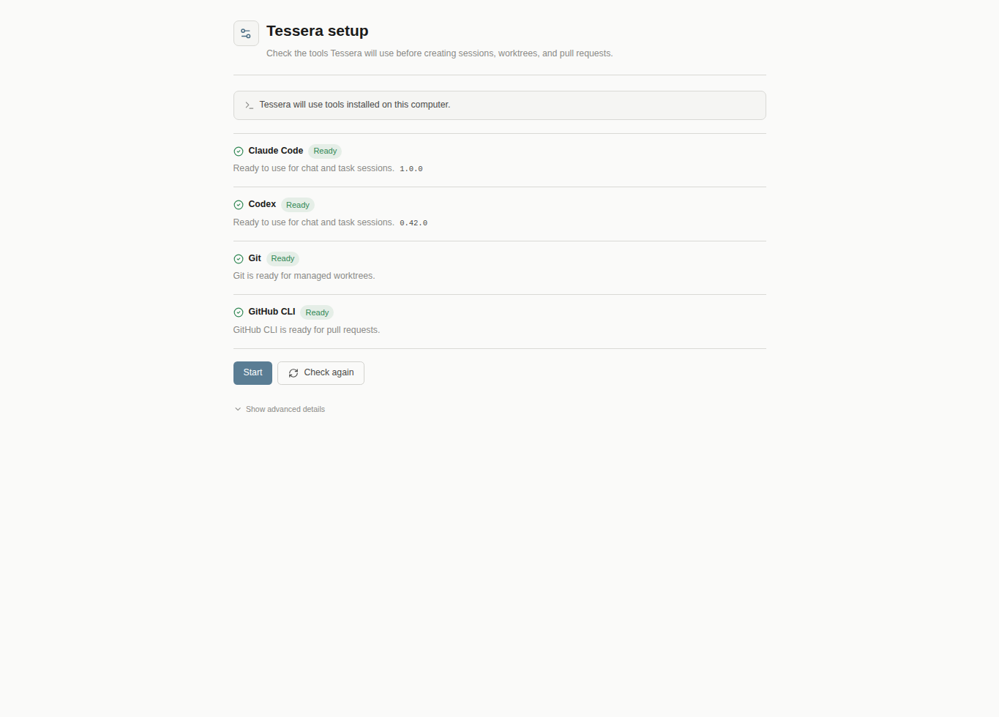

# Tessera

> A multi-CLI coding-agent desktop app and web UI — chat with Claude Code, Codex, and other agent CLIs from one IDE-like interface.

[](https://nodejs.org/)
[](https://nextjs.org/)
[](https://react.dev/)
[](https://www.typescriptlang.org/)
[](https://www.electronjs.org/)
[](#license)

Tessera (package name `@horang-labs/tessera`, repo `Horang-Labs/tessera`) is a web-based and Electron-packaged UI that spawns AI coding-agent CLIs on your machine, streams their output over WebSocket, and wraps them in an IDE-like workspace with tabs, split panels, a kanban board, collections, a git-diff drawer, and session archiving.



---

## Table of Contents

- [Project Status](#project-status)
- [Why Tessera](#why-tessera)
- [Supported CLIs](#supported-clis)
- [Feature Overview](#feature-overview)
- [Prerequisites](#prerequisites)
- [Quick Start (npm Web)](#quick-start-npm-web)
- [Quick Start (Source Web)](#quick-start-source-web)
- [Quick Start (Electron Desktop)](#quick-start-electron-desktop)
- [Project Structure](#project-structure)
- [Tech Stack](#tech-stack)
- [Architecture](#architecture)
- [Keyboard Shortcuts](#keyboard-shortcuts)
- [Environment Variables](#environment-variables)
- [Development Scripts](#development-scripts)
- [Validation](#validation)
- [Production Deployment](#production-deployment)
- [Packaging the Desktop App](#packaging-the-desktop-app)
- [Troubleshooting](#troubleshooting)
- [Contributing](#contributing)
- [License](#license)

---

## Project Status

Tessera is under active development as an open-source project. The runtime is stable for daily use with Claude Code and Codex CLIs, and new providers/features land frequently. Current main-line features include multi-tab / multi-panel chat, a kanban task board, collections, git worktree integration, skill browsing, speech-to-text, and the Electron desktop app.

See [`docs/ARCHITECTURE.md`](docs/ARCHITECTURE.md) for a deep dive into the internals.

## Why Tessera

- **One UI for multiple coding-agent CLIs.** Claude Code today; Codex is also wired up; Gemini CLI, OpenCode, and others plug in through the same provider interface.
- **Third-party friendly.** No hardcoded paths or assumptions about any single CLI's internal layout — per-CLI details live behind `CliProvider` adapters.
- **Local-first.** Your conversations stay on your machine (SQLite DB + the CLI's own storage). No cloud sync.
- **Desktop or browser.** Run the custom Node.js server and open it in any browser, or launch the Electron app that bundles the server.
- **Keyboard-first, tab-based, panel-splittable.** Built for people who live in their editor.

## Supported CLIs

Registered providers at `src/lib/cli/providers/bootstrap.ts`:

| Provider ID    | CLI           | Protocol                                                | Status   |
|----------------|---------------|---------------------------------------------------------|----------|
| `claude-code`  | Claude Code   | `--output-format stream-json --input-format stream-json` (Anthropic streaming events) | ✅ Supported |
| `codex`        | Codex         | `codex app-server` JSON-RPC 2.0 (`initialize → thread/start → turn/start`) | ✅ Supported |
| _(planned)_    | Gemini CLI, OpenCode, … | plug in via a new `CliProvider` adapter        | 🧩 Extensible |

Adding a new CLI is a matter of writing `src/lib/cli/providers/<id>/adapter.ts` that implements `CliProvider` and registering it in `bootstrap.ts`. See `docs/ARCHITECTURE.md` §4 for the full interface.

## Feature Overview

### Chat

- Real-time token streaming with adaptive (~50-160ms) flush buffering to minimize re-renders
- Full tool-call visualization (bash, read/edit/write, web, search, task, …) with per-tool renderers
- Extended-thinking block support (Claude)
- Code blocks with Shiki syntax highlighting (130+ languages) and copy buttons
- Image attachments (paste / drag / upload, base64-encoded, max payload 50 MB)
- Virtualized, windowed message list so multi-MB sessions stay responsive
- Interactive permission prompts and `AskUserQuestion` replies inside the chat

### Workspace

- Browser-style **tabs** with LRU eviction and localStorage persistence
- **Split panels** inside each tab (horizontal / vertical / close) — each panel can host a different session
- Sidebar grouped by project, then by task status / collection
- **Kanban board** view with drag-and-drop task moves (optimistic updates)
- **Collections** — named, colored groupings of sessions within a project
- **Tasks** — kanban entities that can own multiple sessions under a shared `worktree_branch`
- **Archive dashboard** with pagination and auto-expiry of archived worktrees
- **Git diff drawer** per worktree-bound session

### Command & Control

- **Skill picker / skill analysis** — browse and invoke CLI-exposed skills from the message input
- **Plan approval floating panel** — approve, reject, or modify Claude plans inline
- **Runtime model / permission-mode switching** — change the Opus model, permission mode, or reasoning effort mid-session
- **Managed worktrees** — create a git worktree per session with a managed branch prefix
- **CLI connection status** — three-state probe (connected / needs-login / not-installed) per provider × environment (native vs. WSL)
- **Voice input (STT)** — Web Speech API with optional Gemini fallback

### Platform

- **Electron desktop app** (Windows portable, macOS x64 / arm64, Linux AppImage / deb)
- **WSL ↔ Windows routing** — Tessera running in WSL can spawn Windows-native CLI binaries when needed
- **System tray** integration for the desktop build
- **i18n** — English / Korean / Japanese / Chinese

### Security

- JWT **RS256** authentication with auto-generated RSA keys on first run
- `httpOnly` + `SameSite=Strict` cookies
- bcrypt password hashing (`bcryptjs`)
- Per-user session ownership checks on every WebSocket message

---

## Prerequisites

### Required

- **Node.js** 20.x or later (and **npm** 10.x or later) — [download](https://nodejs.org/)
- At least one supported coding-agent CLI installed and authenticated:
  - [**Claude Code CLI**](https://docs.anthropic.com/en/docs/claude-code/overview), or
  - [**Codex CLI**](https://github.com/openai/codex)

Verify:

```bash
node -v         # v20.x or higher
claude --version    # if you plan to use Claude Code
codex --version     # if you plan to use Codex
```

### Optional

- **Gemini API key** if you want AI-powered speech-to-text (`GEMINI_API_KEY`)
- **C++ build toolchain** only if any optional native module rebuild is triggered (Tessera avoids native modules by default — it uses `sql.js` and `bcryptjs`)

---

## Quick Start (npm Web)

```bash
npm install -g @horang-labs/tessera
tessera
```

Tessera starts a local web server and prints the browser URL:

```text
Tessera is running at:
  http://127.0.0.1:32123

Press Ctrl+C to stop.
```

To choose a port:

```bash
tessera --port 3100
```

On first run, Tessera opens the setup flow and asks you to create the first
local account. No default password is created.

Tessera auto-creates `~/.tessera/` (mode `700`) on first run for the SQLite DB, RSA keys, and user config.

## Quick Start (Source Web)

```bash
# 1. Clone
git clone https://github.com/Horang-Labs/tessera.git
cd tessera

# 2. Install
npm install

# 3. Start the dev server (custom server — includes WebSocket on /ws)
npm run dev
# or, to use a non-default port:
./start_dev.sh 3001

# 4. Open http://localhost:3000 (or your chosen port)
```

On first run, Tessera opens the setup flow and asks you to create the first
local account. No default password is created.

Tessera auto-creates `~/.tessera/` (mode `700`) on first run for the SQLite DB, RSA keys, and user config.

## Quick Start (Electron Desktop)

```bash
npm install
npm run electron:dev
# Concurrently starts a dev server on port 3100 and an Electron window pointing at it.
```

For packaged desktop builds, see [Packaging the Desktop App](#packaging-the-desktop-app).

---

## Project Structure

```
tessera/
├── server.ts                     # Custom Node.js HTTP + WebSocket server
├── electron/                     # Electron desktop wrapper
│   ├── main.ts                   #   Main process
│   ├── server-child.ts           #   Spawns the embedded Next.js+WS server
│   ├── preload.ts                #   Preload IPC bridge
│   └── tray.ts                   #   System tray
├── src/
│   ├── app/                      # Next.js App Router
│   │   ├── chat/page.tsx         #   Main UI
│   │   ├── login/page.tsx        #   Auth page
│   │   └── api/                  #   REST API routes (auth, sessions,
│   │                             #   projects, collections, tasks, skills,
│   │                             #   providers, archive, worktrees, stt, …)
│   ├── components/
│   │   ├── chat/                 #   Sidebar, message list, input,
│   │   │   ├── progress/         #   tool-result renderers, thinking blocks,
│   │   │   └── tool-results/     #   permission bars, plan-approval panel, …
│   │   ├── board/                #   Kanban board + columns + cards
│   │   ├── panel/                #   Split panel system
│   │   ├── git/                  #   Git status + diff drawer
│   │   ├── archive/              #   Archive dashboard
│   │   ├── skills/, settings/, notifications/, keyboard/, layout/, auth/, ui/
│   ├── stores/                   # Zustand stores (16) — chat, session,
│   │                             #   tab, panel, board, collection, task,
│   │                             #   notification, usage, rate-limit,
│   │                             #   settings, auth, skill-analysis, …
│   ├── hooks/                    # Custom hooks (30+)
│   ├── types/                    # Shared TypeScript types
│   └── lib/
│       ├── ws/                   #   WebSocket server + client + message types
│       ├── cli/                  #   CLI integration (process manager,
│       │   └── providers/        #   protocol adapters, provider registry)
│       │       ├── claude-code/  #     Claude Code adapter
│       │       └── codex/        #     Codex adapter
│       ├── db/                   #   SQLite via sql.js (schema v20)
│       ├── auth/                 #   JWT RS256 + bcryptjs
│       ├── git/                  #   Worktree diff stats, git panel server
│       ├── archive/              #   Archive service + auto-expiry
│       ├── skill/                #   Skill scanning + analysis
│       ├── settings/             #   User settings + provider defaults
│       ├── i18n/                 #   ko / en / zh / ja
│       ├── keyboard/             #   Shortcut registry
│       └── rate-limit/           #   Rate-limit polling
├── docs/                         # Architecture documentation
├── start_dev.sh                  # Dev launcher (enforces -sTCP:LISTEN kill)
├── start_prd.sh                  # Prod launcher (clean .next + build + start)
└── package.json                  # name: "tessera"
```

## Tech Stack

| Area            | Tech                             | Version |
|-----------------|----------------------------------|---------|
| Framework       | Next.js                          | 16.2    |
| UI              | React                            | 19.2    |
| Language        | TypeScript                       | 5.9     |
| State           | Zustand                          | 5       |
| Styling         | Tailwind CSS                     | 4       |
| Real-time       | `ws`                             | 8.16    |
| Database        | SQLite via `sql.js` (WASM)       | 1.14    |
| Auth            | `bcryptjs` + `jsonwebtoken`      | —       |
| Syntax highlight| Shiki                            | 3.22    |
| Animation       | Framer Motion                    | 12      |
| Icons           | Lucide React                     | 0.563   |
| i18n            | i18next + react-i18next          | 25 / 16 |
| Logging         | Pino (+ pino-pretty)             | 8       |
| Desktop         | Electron                         | 33      |
| Desktop builder | electron-builder                 | 25      |

## Architecture

Short version: a custom Node.js server (`server.ts`) hosts Next.js and a WebSocket endpoint (`/ws`) on the same port. The server spawns coding-agent CLIs as child processes and relays their output to the browser after per-provider parsing.

```
Browser (React + Zustand)
    │  WebSocket (/ws, JSON messages, JWT-authenticated)
    ▼
Node.js server (server.ts)
    ├── Next.js (App Router, API routes, SSR)
    ├── WebSocket server (ws/server.ts)
    ├── ProcessManager  ──►  CLI child process (claude / codex / …)
    │   └── ProtocolAdapter  ◄── stdout  ── JSON lines
    ├── sql.js SQLite (~/.tessera/tessera.db)
    └── RSA JWT keys (~/.tessera/auth/)
```

For full details — provider registry, schema tables, WebSocket message types, kanban data flows — see [`docs/ARCHITECTURE.md`](docs/ARCHITECTURE.md).

## Keyboard Shortcuts

All shortcuts use **Ctrl** on Windows/Linux and **Cmd** on macOS.

### Sessions

| Shortcut                       | Action                               |
|--------------------------------|--------------------------------------|
| `Ctrl+T`                       | New session                          |
| `Ctrl+W`                       | Close current session                |
| `Ctrl+1` … `Ctrl+9`            | Jump to session 1–9                  |
| `Ctrl+Tab` / `Ctrl+Shift+Tab`  | Next / previous session              |

### Tabs & Panels

| Shortcut                       | Action                               |
|--------------------------------|--------------------------------------|
| `Ctrl+B`                       | Toggle sidebar                       |
| `Ctrl+Shift+D`                 | Split panel right                    |
| `Ctrl+Shift+X`                 | Split panel down                     |
| `Ctrl+Shift+W`                 | Close current panel                  |
| `Ctrl+Shift+Arrow`             | Move focus between panels            |
| `Alt+PageDown` / `Alt+PageUp`  | Next / previous tab                  |

### Misc

| Shortcut                       | Action                               |
|--------------------------------|--------------------------------------|
| `Ctrl+,`                       | Open settings                        |
| `Ctrl+/` or `?`                | Show keyboard shortcuts help         |
| `Ctrl+Alt+V`                   | Voice input                          |

Shortcuts can be customized in the settings panel (Keyboard section). See `src/lib/keyboard/` for the registry.

## Environment Variables

Copy `.env.example` to `.env` and edit as needed:

```bash
cp .env.example .env
```

| Variable                 | Default                                    | Purpose                                          |
|--------------------------|--------------------------------------------|--------------------------------------------------|
| `PORT`                   | `3000`                                     | Server port (3000 is reserved for production; use 3001+/3100 for dev) |
| `NODE_ENV`               | `development`                              | `production` for prod builds                     |
| `USERS_FILE_PATH`        | `~/.tessera/users.json`                    | User account file                                |
| `AUTH_KEYS_DIR`          | `~/.tessera/auth`                          | RSA key directory                                |
| `SESSIONS_METADATA_DIR`  | `~/.tessera/sessions`                      | Session metadata scratch directory               |
| `JWT_PRIVATE_KEY_PATH`   | _(auto-generated)_                         | Override JWT private key path                    |
| `JWT_PUBLIC_KEY_PATH`    | _(auto-generated)_                         | Override JWT public key path                     |
| `CLAUDE_CLI_PATH`        | `claude`                                   | Path to the Claude Code binary (if not in PATH)  |
| `GEMINI_API_KEY`         | _(none)_                                   | Enables Gemini-powered STT (voice input)         |
| `GEMINI_MODEL`           | `gemini-2.5-flash`                         | Gemini model for STT                             |
| `LOG_LEVEL`              | `info`                                     | `debug` / `info` / `warn` / `error`              |
| `TESSERA_DEV_PORT`       | `3100`                                     | Port that `electron:dev` waits on                |

## Development Scripts

```bash
# Custom dev server (Next.js + WebSocket on the same port)
npm run dev
# or, with a specific port and automatic port cleanup:
./start_dev.sh 3001

# Production (rebuilds .next, binds to $PORT or 3000)
./start_prd.sh 3000
# or manually:
npm run build && npm start

# Lint / type-check
npm run lint
npx tsc --noEmit

# Electron dev
npm run electron:dev
```

> ⚠️ Do **not** run `next dev` directly — the WebSocket server lives in `server.ts`, and running Next.js alone means CLI spawns cannot stream back to the browser.
>
> ⚠️ Do **not** run two dev servers in the same worktree (even on different ports). The `.next/` cache will collide and builds will break.

## Validation

The initial public export does not include the internal test and E2E suites. Validate public changes with:

```bash
npm run lint
npx tsc --noEmit
NODE_ENV=production npm run build
```

## Production Deployment

### Single-host (common case)

```bash
npm ci
npm run build
./start_prd.sh 3000
# or: NODE_ENV=production PORT=3000 tsx server.ts
```

Tessera binds to `localhost` by default — put it behind a reverse proxy (nginx, Caddy, Traefik) with HTTPS if you want to expose it on a network.

Back up `~/.tessera/tessera.db` to preserve sessions, `~/.tessera/auth/` to preserve JWT keys, and `~/.tessera/users.json` to preserve accounts.

### With PM2

```bash
npm install -g pm2
pm2 start npm --name "tessera" -- start
pm2 startup
pm2 save
```

## Packaging the Desktop App

Build targets are declared in `package.json` under `build.*`.

```bash
npm run electron:build:win          # Windows portable x64  (release/Tessera.exe)
npm run electron:build:mac-x64      # macOS Intel zip
npm run electron:build:mac-arm64    # macOS Apple Silicon zip
npm run electron:build:all          # Everything supported on the current host
```

Packaging notes:

- `asar: true` with `sql.js` in `asarUnpack` so the WASM binary is loadable at runtime.
- `npmRebuild: false` because Tessera avoids native modules (we use `sql.js` and `bcryptjs`).
- Build output: `release/` (git-ignored).

## Troubleshooting

**`Port 3000 is already in use`** — another process (often a previous prod server) holds it. Pick a different dev port (`./start_dev.sh 3001` or `PORT=3001 npm run dev`). The bundled `start_dev.sh` only kills `LISTEN`-state processes so it won't break an ngrok tunnel connected to the same port.

**`spawn claude ENOENT` / `spawn codex ENOENT`** — the CLI binary isn't in `PATH`. Set `CLAUDE_CLI_PATH=/absolute/path/to/claude` in `.env`, or use the settings UI (CLI detection reports `not_installed` in this case).

**`needs_login` status on a provider** — the CLI binary runs but auth is missing. Run `claude login` / `codex login` (or the provider's equivalent) and the status will flip to `connected` on the next probe.

**WebSocket connected, messages don't stream** — you probably started with `next dev`. Stop it and use `npm run dev` / `./start_dev.sh` instead. WebSocket only runs under the custom server.

**Permission errors on `~/.tessera/`** — on first run Tessera creates this directory with mode `700`. If you copied files in as another user, fix ownership:

```bash
sudo chown -R "$(whoami)" ~/.tessera/
```

**JWT verification failed / unreadable RSA keys** — delete the auth directory and let Tessera regenerate on next start:

```bash
rm -rf ~/.tessera/auth
npm run dev
```

**Worktree install broke the build** — if you're developing across multiple git worktrees, never symlink / share `node_modules` or `.next/` between them. Each worktree needs its own `npm install`.

## Contributing

### Branches

- `main` — released
- `dev` — integration branch for new work
- `feature/*`, `fix/*`, `chore/*` — topic branches off `dev`

### Workflow

```bash
git checkout dev
git pull origin dev
git checkout -b feature/my-thing

# work, then:
npm run lint
npx tsc --noEmit
npm run build
```

PRs go against `dev`. See [CONTRIBUTING.md](CONTRIBUTING.md) for the full contributor workflow.

### Code style

- TypeScript strict mode
- Functional React components + hooks
- Tailwind utility classes first
- Kebab-case file names; PascalCase for component identifiers inside files
- Don't add abstraction, fallback handling, or feature flags beyond what the task needs

---

## License

MIT License © Horang Labs

See the [LICENSE](LICENSE) file for the full text.
