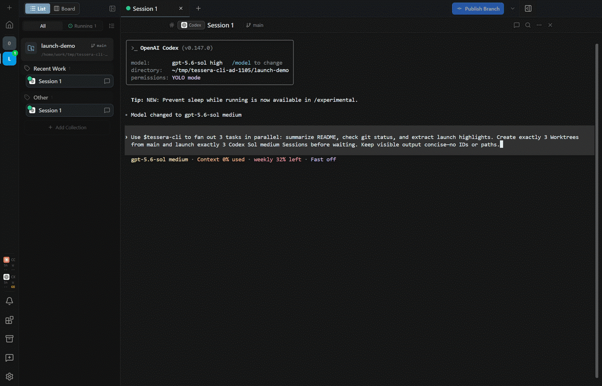
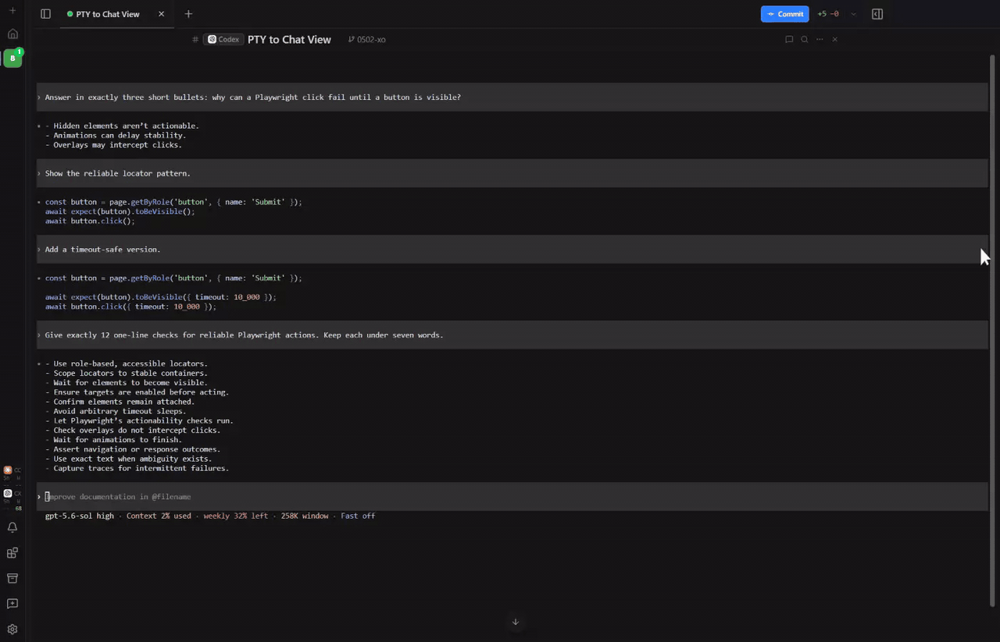
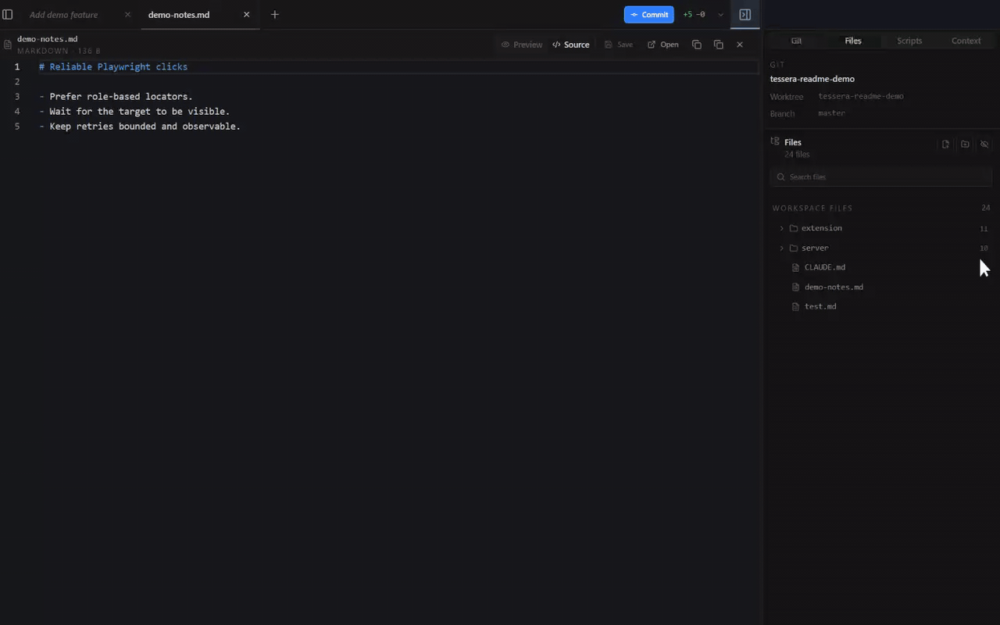

<p align="center">
  
</p>

<h1 align="center">Tessera</h1>

<p align="center"><strong>Run more agents. Lose less context.</strong></p>

<p align="center">
  The local control room for Claude Code, Codex, and OpenCode—parallel sessions, isolated worktrees, Git, and mobile access in one place.
</p>

<p align="center">
  <a href="https://github.com/horang-labs/tessera/stargazers"></a>
  <a href="https://www.npmjs.com/package/@horang-labs/tessera"></a>
  <a href="https://nodejs.org/"></a>
  <a href="#license"></a>
  <a href="https://discord.gg/7557zmY8x"></a>
</p>

<p align="center">
  <strong><a href="https://github.com/horang-labs/tessera/releases">Download Tessera</a></strong>
  · <a href="#browser-runtime">Run with npm</a>
  · <a href="https://discord.gg/7557zmY8x">Join Discord</a>
</p>

<p align="center">
  
</p>

## One workspace for the entire agent loop

Tessera turns a pile of terminals into a visible workflow. Give each task its own session and isolated worktree, follow every agent without hunting through windows, and take the result all the way to a pull request.

- **Delegate in parallel** — run independent tasks without agents stepping on the same branch.
- **Use the right agent and model** — mix Claude Code, Codex, and OpenCode in PTY or GUI mode, including custom model IDs.
- **Keep every session within reach** — move between list, board, tabs, split panes, and your phone without losing the conversation.
- **Finish where the work happened** — inspect files and diffs, commit, sync, publish branches, and open pull requests from Tessera.

> [!NOTE]
> Tessera runs locally and uses the provider CLIs already installed and authenticated on your machine.

## Let the lead agent run the workspace

Invoke `/tessera-cli` inside a managed Codex or Claude Code session. A lead agent can create isolated worktrees, launch parallel sessions, wait for results, inspect their output, and send follow-up prompts—while every worker stays visible in Tessera.

Representative operations: `status` · `worktree create` · `session launch` · `session wait` / `session read` · `session prompt`



## Keep coding from your phone

Pair a device from **Settings → Remote access**. Continue PTY and GUI sessions, switch a PTY into Chat View, and open the session or Files/Git panels from mobile.

<p align="center">
  
</p>

## PTY speed, chat readability

Open a Codex or OpenCode PTY and press the chat icon in its header. Chat View turns the live terminal conversation into a focused, readable thread without stopping the PTY underneath.



## Finish the Git workflow without switching apps

Edit project files, review diffs, select changes, commit, sync, publish branches, and open pull requests without leaving the session.



## Built for real-world agent work

| Built for | What you get |
|---|---|
| **Projects and sessions** | Collections, persistent tabs, split panes, list view, and Kanban board. |
| **Terminal and GUI** | Run PTY sessions and rich conversations side by side in the same workspace. |
| **Custom models** | Add custom model IDs in Settings and select them when starting a session. |
| **Live context** | Follow tool calls, failures, instructions, memory, file changes, diffs, and branch state. |
| **Task-aware Git** | Keep tasks, sessions, worktrees, and pull requests connected from start to finish. |

<table>
  <tr>
    <td width="50%"></td>
    <td width="50%"></td>
  </tr>
</table>

## Install

### Desktop app

Download from [GitHub Releases](https://github.com/horang-labs/tessera/releases).

| Platform | Asset |
|----------|-------|
| Windows, including WSL | Portable `.exe` |
| macOS | `.dmg` for Apple Silicon or Intel |
| Linux beta | `.deb` |

Windows builds are not code-signed yet, so SmartScreen may show an unknown-publisher warning. macOS builds are signed and notarized with Apple Developer ID.

### Browser runtime

Requires Node.js 20 or later and npm 10 or later.

```bash
npm install -g @horang-labs/tessera
tessera
```

Open the printed local URL.

### Docker Compose

```bash
mkdir -p data/config data/local data/ssh data/codex data/tessera workspaces
touch data/gitconfig
docker compose up --build -d
```

Open `http://127.0.0.1:32123`. If bind mounts are not writable:

```bash
sudo chown -R 1000:1000 data workspaces
```

## First Run

On first run, Tessera guides you through:

1. Creating a local account for the browser runtime.
2. Checking that a supported CLI is installed and authenticated.
3. Selecting a project folder.
4. Starting a chat or worktree-backed task.

Authenticate provider CLIs first, for example with `claude login`, `codex login`, or OpenCode's configured provider credentials.

## Build From Source

For development, clone the repository and install dependencies:

Source development requires Node.js 20 or later and npm 10 or later.

```bash
git clone https://github.com/horang-labs/tessera.git
cd tessera
npm install
```

Tessera uses a custom Node.js server for the Next.js app, WebSocket transport, database initialization, provider bootstrapping, and background pollers. The dev script starts that server:

```bash
npm run dev
```

Supported environment variables:

| Variable | Default | Purpose |
|----------|---------|---------|
| `TESSERA_DATA_DIR` | `~/.tessera` | App data root for the database, local users, auth keys, settings, worktrees, attachments, and session history |
| `PORT` | `3000` from source, `32123` from the npm CLI | HTTP server port for source and npm runs |
| `TESSERA_HOST` | `127.0.0.1` | Host interface for source and npm runs. `HOST` is also accepted by the source server |
| `LOG_LEVEL` | `info` | Backend log level: `debug`, `info`, `warn`, or `error` |
| `CLAUDE_CONFIG_DIR` | `~/.claude` | Override the Claude Code config directory used for skill discovery |

Desktop release builds use Electron:

| Target | Command |
|--------|---------|
| Windows portable `.exe` | `npm run electron:build:win` |
| macOS Apple Silicon dev `.dmg` | `npm run electron:build:mac-arm64` |

Electron build outputs are written under `release/`.

## Stored Data And Privacy

Tessera runs locally, stores app data under `~/.tessera/` by default, and sends provider requests through the Claude Code, Codex, or OpenCode CLI installed on your machine.

Published builds include anonymous product-interaction telemetry that you can disable during onboarding or in Settings. This includes which named controls and features are used, anonymous Tessera CLI operation names, and a coarse mobile-or-desktop classification computed locally, but never visible UI text, prompts, messages, CLI arguments, file paths, command output, repository names, raw device details, or account details.

## Teams And Design Partners

Tessera is currently focused on individual local workflows, but we are preparing team and enterprise features for companies running coding agents across multiple developers.

The team product is being shaped around three areas: shared workspaces for parallel agent work, governance for permissions and tool use, and operational visibility into agent usage, cost, and review state.

If your team wants to use Tessera in production, [join the design partner waitlist][design-partner-waitlist].

## Roadmap

Planned areas include:

| Area | Direction |
|------|-----------|
| Cloud team collaboration | Shared projects, team-visible task state, and collaborative review workflows |
| Enterprise governance | Permission management, tool-use policies, audit trails, and controls for blocked or unapproved agent actions |
| Agent operations analytics | Visibility into agent efficiency, model/provider usage, and cost patterns across a team workspace |
| Team memory | Shared project context and team-specific agent memory for recurring workflows |
| Multi-agent collaboration | A lead agent that coordinates task creation, review, Git workflow management, and parallel worker agents |
| Tessera-native agent | A built-in agent experience in addition to external CLI providers |
| Web debugging | Browser inspection, logs, screenshots, and frontend debugging context |

## License

Tessera is open source under the GNU Affero General Public License v3.0 (`AGPL-3.0`).

Copyright (c) 2026 Horang Labs, Inc.

See the [LICENSE](LICENSE) file for the full text.

[design-partner-waitlist]: https://docs.google.com/forms/d/e/1FAIpQLSdbo5haZdekBrQNwt_F-UlloQu-s4SkUV4tZCU0cONwKJX8Tw/viewform
