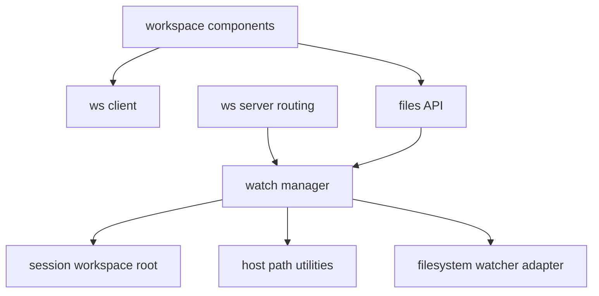
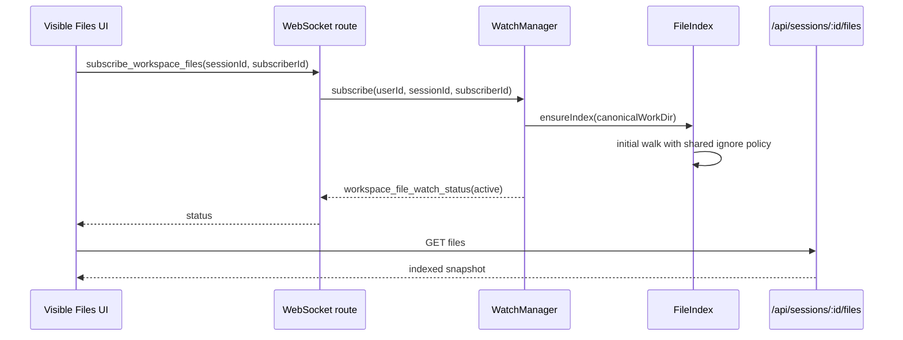
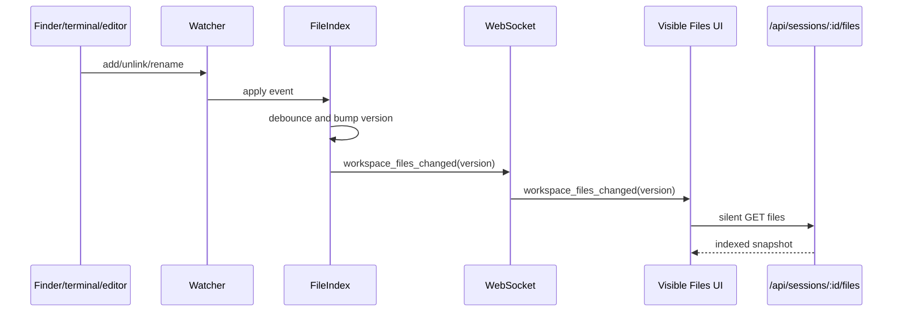

# Architecture Spine - Tessera Workspace Files Live Sync

## Design Paradigm

Files live sync uses a visible-subscriber watcher pattern.

The UI does not poll by default. A visible Files surface subscribes to a workspace root; the server owns filesystem observation and a normalized file index; WebSocket messages tell clients when that index changed. Clients then reconcile their local tree state from the indexed snapshot.

```mermaid
flowchart LR
  UI[Visible Files surface] -->|subscribe sessionId| WS[WebSocket route]
  WS --> Manager[WorkspaceFileWatchManager]
  Manager --> Resolver[Session workspace root resolver]
  Resolver --> Index[WorkspaceFileIndex keyed by canonical workDir]
  Index --> Watcher[Filesystem watcher]
  Watcher -->|add unlink addDir unlinkDir| Index
  Index -->|debounced version event| WSOut[workspace_files_changed]
  WSOut --> UI
  UI -->|silent reconcile| API[/api/sessions/:id/files]
  API --> Index
```

Dependency direction:



## Invariants & Rules

### AD-1 - Visibility owns subscription lifetime

- **Binds:** WorkspaceFilePanel, WorkspaceExplorerTab, tab/panel visibility handling
- **Prevents:** Hidden tabs or inactive panels consuming filesystem watchers and stale visible panels never subscribing.
- **Rule:** A Files surface must subscribe only while it is actually visible to the user and `document.visibilityState === "visible"`. It must unsubscribe on session change, panel/tab close, hidden tab state, or document hidden.

### AD-2 - Canonical workDir owns watcher identity

- **Binds:** WorkspaceFileWatchManager, session workspace root resolver
- **Prevents:** Duplicate watchers for the same workspace and inconsistent state between panels viewing the same workDir.
- **Rule:** Watchers and indexes are keyed by canonical host filesystem root, not by panel id, tab id, or session id. Subscriptions are reference-counted by `{userId, clientId, sessionId, subscriberId}`.

### AD-3 - Server owns the file index

- **Binds:** /api/sessions/[id]/files, WorkspaceFileWatchManager
- **Prevents:** Every refresh recursively scanning the full repo and clients deriving incompatible file lists.
- **Rule:** When a visible subscription exists, the server maintains an in-memory `Set<string>` of workspace-relative file paths for that canonical root. `/api/sessions/:id/files` returns that indexed snapshot. Full recursive walk is used for index bootstrap, no-index fallback, and explicit reconcile.

### AD-4 - Watcher events invalidate; snapshots reconcile

- **Binds:** WebSocket transport, WorkspaceFilePanel, WorkspaceExplorerTab
- **Prevents:** Large file lists being pushed over WebSocket and clients applying partial filesystem deltas incorrectly.
- **Rule:** Watcher changes emit only `workspace_files_changed` with `{sessionIds, workDir, version}` after debounce. Clients treat the event as invalidation and silently refetch the file-list snapshot before updating UI.

### AD-5 - File tree and file content refresh are separate channels

- **Binds:** WorkspaceFilePanel, WorkspaceExplorerTab, WorkspaceFileTab
- **Prevents:** Content-only file writes rebuilding the whole tree and file creation/deletion leaving open file tabs stale.
- **Rule:** Tree subscriptions react to path membership events: `add`, `unlink`, `addDir`, `unlinkDir`, and rename equivalents. Open file content tabs react to `change` for their exact path and to `unlink` by showing a file-not-found state.

### AD-6 - Ignore rules are a shared module

- **Binds:** initial walk, watcher adapter, fallback reconcile, files API
- **Prevents:** Initial lists, live updates, and fallback refreshes disagreeing about `.git`, `node_modules`, `.next`, `dist`, `build`, and hidden files.
- **Rule:** Ignore names and hidden-file policy live in one shared server module. No caller may duplicate its own ignore set.

### AD-7 - Polling is degraded mode only

- **Binds:** WorkspaceFilePanel, WorkspaceExplorerTab, WorkspaceFileWatchManager
- **Prevents:** 1-2 second full-tree polling becoming the primary architecture and overloading large workspaces.
- **Rule:** Visible-only polling is allowed only when watcher setup fails, a watcher overflow is detected, or a platform path is unsupported. Fallback interval is 2 seconds while visible; it stops immediately when hidden.

### AD-8 - Backpressure beats freshness under load

- **Binds:** WebSocket event scheduling, client reconcile fetches
- **Prevents:** Event storms from dependency installs, branch switches, or generated directories flooding UI and server.
- **Rule:** Watcher events are coalesced per canonical workDir with a 250-500ms debounce and monotonically increasing version. A client with an in-flight reconcile does not start another request; it records the latest version and reconciles once more after the current request completes.

### AD-9 - Security stays session-scoped

- **Binds:** WebSocket subscribe route, files API, session access checks
- **Prevents:** A client subscribing to a workspace outside the sessions it can access.
- **Rule:** Clients subscribe by `sessionId` only. The server resolves the workDir and reuses the existing session access checks before adding a subscriber. Clients never send absolute paths to create watchers.

### AD-10 - Snapshot compatibility is preserved

- **Binds:** /api/sessions/[id]/files, WorkspaceFilePanel, WorkspaceExplorerTab
- **Prevents:** Live sync breaking existing file picker/reference-session behavior or causing UI churn from nondeterministic traversal order.
- **Rule:** The file-list API response keeps the current envelope: `files`, `chats`, `tasks`, `truncated`, `reason`, and `workDir`. Indexed and walked snapshots both return deterministic sorted relative paths and enforce the same `MAX_FILES`/`truncated` behavior.

## Consistency Conventions

| Concern | Convention |
| --- | --- |
| Server module names | `workspace-file-watch-manager.ts`, `workspace-file-index.ts`, `workspace-file-ignore.ts`, `workspace-file-events.ts` under `src/lib/workspace-files/` |
| Client hook names | `useWorkspaceFilesLiveSync` for Files tree surfaces; `useWorkspaceFileContentRefresh` only if content refresh is split from `WorkspaceFileTab` |
| WebSocket client messages | `subscribe_workspace_files`, `unsubscribe_workspace_files` |
| WebSocket server messages | `workspace_files_changed`, `workspace_file_watch_status` |
| Subscriber id | Stable client-generated id per visible Files surface: `{panelId}:{sessionId}` or special tab equivalent |
| File paths | Always workspace-relative POSIX-style paths in UI/API payloads; absolute paths remain server-side except existing `workDir` response field |
| Errors | Watcher failure is non-fatal: send `workspace_file_watch_status` and enter visible polling fallback |
| Logging | Log watcher start/stop, fallback activation, overflow/reconcile, and slow bootstrap with canonical workDir and subscriber count |
| Snapshot ordering | Sort relative paths before returning file snapshots from either index or walk |

## Stack

| Name | Version |
| --- | --- |
| Node.js | >=20.0.0 |
| Next.js | 16.2.3 |
| React | 19.2.5 |
| TypeScript | 5.9.3 |
| ws | 8.16.0 |
| Electron | 33.0.0 |

## Structural Seed

```text
src/lib/workspace-files/
  workspace-file-ignore.ts        # shared ignore policy for walk, watcher, fallback
  workspace-file-index.ts         # canonical-root file Set, version, bootstrap/reconcile
  workspace-file-watch-manager.ts # ref-counted subscriptions and watcher lifecycle
  workspace-file-events.ts        # WS payload builders and type helpers
```

```text
src/components/workspace/
  workspace-file-panel.tsx        # visible subscription + snapshot reconcile
  workspace-explorer-tab.tsx      # same subscription contract as side panel
  workspace-file-tab.tsx          # path-specific content refresh on change/unlink
```

Bootstrap/reconcile flow:



Change flow:



Fallback flow:

```mermaid
flowchart LR
  WatchError[watcher setup error or overflow] --> Status[workspace_file_watch_status fallback]
  Status --> Client[visible Files client]
  Client -->|2s while visible| API[/api/sessions/:id/files]
  API --> Walk[full walk with shared ignore policy]
  Walk --> Client
```

## Capability -> Architecture Map

| Capability / Area | Lives in | Governed by |
| --- | --- | --- |
| External add/delete appears within 1-2 seconds | `workspace-file-watch-manager.ts`, `workspace-file-index.ts`, Files UI hook | AD-1, AD-2, AD-3, AD-4, AD-8 |
| No manual refresh required | WebSocket invalidation + silent reconcile | AD-4, AD-8 |
| No full-tree polling as primary behavior | Watcher/index path | AD-3, AD-7 |
| Multiple panels/tabs viewing same workspace stay consistent | Canonical workDir watcher/index | AD-2, AD-4 |
| Hidden tabs do not waste resources | Visibility-scoped subscriptions | AD-1 |
| Open file content updates independently | `WorkspaceFileTab` content channel | AD-5 |
| Large ignored folders stay ignored everywhere | shared ignore module | AD-6 |
| Unauthorized workspace watch cannot be requested | server-side sessionId resolution | AD-9 |
| Existing file references remain compatible | files API envelope | AD-10 |

## Deferred

| Decision | Why it can wait | Revisit when |
| --- | --- | --- |
| `chokidar` vs Node `fs.watch` | The spine binds watcher semantics, not the adapter choice. Current dependencies do not include `chokidar`; implementation should spike platform behavior before adding a dependency. | First implementation story starts or platform-specific watcher gaps appear. |
| Persistent on-disk file index | Requirement only needs open-tab freshness. In-memory index with bootstrap/reconcile is enough. | App needs file search across closed workspaces or startup pre-indexing. |
| Incremental client-side tree patching | Snapshot reconcile is simpler and avoids partial-delta bugs. | File lists become large enough that snapshot transfer/render is the bottleneck. |
| Watch closed but recently used tabs | User requirement is open/visible Files tab only. | Product requires background freshness for hidden tabs. |

## Open Questions

| Question | Current assumption |
| --- | --- |
| Should the first implementation use `chokidar`? | Start with an adapter interface and choose after a small macOS/Windows/Linux spike. |
| Should `WorkspaceExplorerTab` hidden by tab LRU count as open? | No. Only visible tab panel should subscribe. |
| Should content `change` events update Monaco without focus? | Yes for visible open file tabs, but this is separate from the file tree. |
