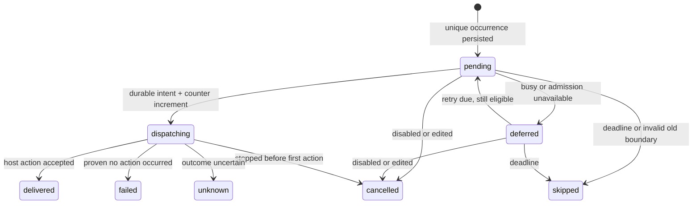

# Persistent Session wake-ups and scheduled runs (#523)

Status: **implementation contract reconciled with authorized product decisions**, not implemented behavior. Amendment review fixed point: `c472662ec81ae9daa11ce49336a8343f2a1ea0c3`. Baseline: `14bd501e9e87579fe410fb2b70375709f464ee12` (2026-10-02 research). [Source research and exact anchors](../research/session-automation-tessera.md) distinguish observed behavior from proposals. [Wave brief](session-automation-wave.md) and [issue #523](https://github.com/horang-labs/tessera/issues/523) define scope. The [product decisions](session-automation-product-decisions.md), [acceptance scenarios](session-automation-acceptance.md), and latest user clarification supersede the original scope choices. Reviewed sibling [Orca research](../research/session-automation-orca.md) and [Paseo/T3 research](../research/session-automation-paseo-t3.md) now inform the rationale below.

## Outcome and bounded scope

Provide opt-in rules that either (a) send a saved continuation prompt to an existing PTY Session after a confirmed lead turn settles, or (b) create a fresh PTY Session on a one-time or fixed-interval schedule. One backend Automation domain owns scheduling, admission, persisted attempts, limits, and history. A rule does not decide whether the user's work is finished.

Authorized v1: Claude Code and Codex; text-only prompts; existing live Worktree for scheduled creation; existing PTY Session for wake-up; one active rule per target Session; explicit arming gives automation exclusive Session input ownership while visible output remains usable. GUI/protocol execution, daily/calendar/cron/DST recurrence, external triggers, auto-approval, task/issue completion inference, automatic Worktree creation, and provider-independent goal evaluation are excluded. OpenCode is an explicit follow-up because the detached launch path does not carry its model/effort selection. Unsupported provider/settings must fail validation rather than appear saved successfully.

## Small domain and invariants

- **Automation**: owner-scoped, versioned rule with explicit target, trigger, prompt, saved execution selection, enabled state, expiry, and finite dispatch limit.
- **AutomationRun**: one immutable occurrence and the audit of its dispatch attempt. Its ID is the idempotency key through scheduling and the runtime adapter. `delivered` means a host Enter write or initial-prompt launch was accepted by Tessera, never that the model complied or the task succeeded.
- **Boundary**: runtime-owned evidence for a potential next turn: server instance, terminal generation, Session binding, foreground turn sequence, and input revision. A timestamp or output counter alone is insufficient.
- **Runtime adapter**: small provider-aware layer over the existing launch and TerminalManager paths. The scheduler knows no PTY bytes, argv, transcript paths, or provider-specific hook mappings.

At most one scheduler per DB profile; at most one in-flight dispatch per rule and per Session; no permission answering; no mixing with a human draft; no unconditional replay after a possible side effect; all execution carries the recorded owner and verified agent environment. Pause/delete/expiry stop new dispatch. An already-started paste/Enter transaction must settle or become explicitly unknown before input ownership can return to the user; none of these controls kills the running agent. Persisted due times are authoritative; timer callbacks only request reconciliation.

## Contracts (proposed, version 1)

All times in API payloads are integer UTC epoch milliseconds; server time is authoritative. One-shot uses an absolute instant; interval uses an absolute anchor plus fixed elapsed milliseconds. The client displays the saved instant in its local timezone, including offset, without changing the schedule. No zone/cron/calendar field is accepted. IDs are opaque strings generated by the backend. Reject unknown fields. JSON stored in the DB is validated against these same contracts.

```ts
type Provider = 'claude-code' | 'codex';
type Trigger =
  | { kind: 'once'; at: number }
  | { kind: 'interval'; anchorAt: number; everyMs: number }
  | { kind: 'turn-complete'; delayMs: number };

type Selection = {
  provider: Provider;
  model: string;                    // explicit resolved model, no implicit default
  reasoningEffort: string;          // explicit supported value, not "auto"
  serviceTier: 'default' | 'fast' | null; // Codex requires value; Claude requires null
  settings: { permissionPolicy: 'inherit-cli'; allowPreparationFailure: false };
};
type Target =
  | { kind: 'create-session'; worktreeId: string; title: string; selection: Selection }
  | { kind: 'wake-session'; sessionId: string };
type AutomationInput = {
  name: string;
  enabled: boolean;
  target: Target;
  trigger: Trigger;
  prompt: string;
  limits: { maxDispatches: number; expiresAt: number };
};
type AutomationState = 'enabled' | 'disabled' | 'paused' | 'exhausted' | 'expired' | 'deleted';
type Automation = Omit<AutomationInput, 'enabled'> & {
  id: string; revision: number; state: AutomationState;
  pauseReason: string | null;
  ownerUserId: string; agentEnvironment: 'native' | 'wsl';
  savedSelection: Selection;         // target selection or inspected Session selection
  nextDueAt: number | null;
  dispatchCount: number;             // includes unknown attempts; never reset on edit
  createdAt: number; updatedAt: number; deletedAt: number | null;
};
type RunState = 'pending' | 'deferred' | 'dispatching' | 'delivered'
  | 'skipped' | 'failed' | 'unknown' | 'cancelled';
type AutomationRun = {
  id: string; automationId: string; automationRevision: number;
  occurrenceKey: string; dueAt: number; deadlineAt: number;
  coalescedCount: number;            // omitted older due slots, zero for wake/once
  state: RunState; reason: string | null;
  sessionId: string | null; terminalId: string | null;
  boundaryId: string | null;
  attemptStartedAt: number | null; deliveredAt: number | null; finishedAt: number | null;
  effectiveSelection: Selection;
  agentEnvironment: 'native' | 'wsl';
  observedRuntime: 'unobserved' | 'starting' | 'running' | 'input-required'
    | 'turn-complete' | 'exited' | 'unknown';
};
```

Validation bounds: name/title 1–120 characters; normalized prompt 1–32 KiB UTF-8; interval 60 seconds–30 days; turn delay 30 seconds–24 hours; maxDispatches 1–100; expiresAt after now and at most 90 days away. Once/anchorAt must be future on initial save and before expiry. Editing an unchanged interval anchor retains it, advancing to its next future slot; a newly selected anchor must be future. API requires fully specified limits/delay, with the shared contract exporting these UI defaults:

| Kind | Default delay/cadence | Default maxDispatches | Default expiry |
|---|---|---|---|
| wake / turn-complete | 120,000 ms (2 minutes) | 10 | now + 8 hours |
| create / interval | user chooses anchor and interval explicitly | 100 | now + 30 days |
| create / once | user chooses exact UTC instant | **1, enforced** | now + 30 days; user extends if the chosen instant requires it, within 90-day bound |

Only `wake-session + turn-complete` and `create-session + once/interval` are valid. Daily/calendar/cron/DST recurrence is deferred. SessionStart idle and InterruptFallback do not qualify. Enabling wake is an explicit input takeover, not an idle-time heuristic: acquire the server input gate and verify a clean completed lead boundary, or a known submitted running turn with no subsequent raw input/prefill/permission/unknown state. First arm at a clean completed boundary schedules now+delay; arm during a known turn waits for that turn's confirmed completion. Normal ticks never reuse a consumed boundary. Read-only watchers and subscriber counts have no effect on eligibility. A local unsent ChatView draft remains locally saved and read-only while armed; it is never part of the PTY prompt. Already-written unsent PTY text makes the boundary dirty and prevents arming.

Save explicit provider/model/effort/tier using existing provider option definitions and capabilities; revalidate before dispatch, and pause on unsupported selection without substituting a default. Custom model IDs may be accepted only through the same explicitly supported custom-model path as normal Session creation; lack of catalog evidence is not proof of runtime availability. Codex fast is an explicit choice; never infer fast from a model. For wake rules, save the persisted Session selection and compare at admission; do not mutate a live Session's model. Label this “saved launch selection,” not verified live TUI configuration. Native TUI changes can escape persisted selection tracking; users must pause before manual input or settings changes; re-arm validates the saved selection again. Previously issued native TUI changes may still escape persisted selection tracking, which must be labelled rather than claimed verified.

`settings.permissionPolicy=inherit-cli` means provider-native approvals/configuration remain effective at execution time, not that all CLI configuration is frozen. Arbitrary permissionMode, sandbox flags, environment variables, argv, credentials, or tool permissions are not accepted. GUI creation settings are not automatically reusable for detached PTY launch. Supporting a frozen full provider settings profile is a separate adapter contract decision; do not claim it exists.

## HTTP and internal runtime API

Use authenticated Next routes and existing origin gate, not the local Control credential as browser auth. Never accept ownerUserId/agentEnvironment from the request body. Resolve the configured server owner, require the authenticated user to match it, then persist that exact identity and strict owner settings. Other authenticated users get 403; access to another owner's rule ID gets 404. The current shared Session/Project schema does not implement per-user ACLs: v1 is intentionally restricted to the configured runtime owner. Recheck target existence, kind, live Worktree, archive/delete state, and environment compatibility on writes and dispatch.

| Endpoint | Request | Response and behavior |
|---|---|---|
| `GET /api/automations?sessionId=&worktreeId=&includeDeleted=&cursor=&limit=` | optional one target filter, includeDeleted default false, limit 50/max 100 | 200 `{items: Automation[], nextCursor: string|null}` owner scoped. Deleted rules remain queryable in history view. |
| `POST /api/automations` | AutomationInput; required `Idempotency-Key` (1–128 chars) | 201 `{automation, inputOwnership}`; identical retry returns original creation result without re-arming, changed body with same key 409. Enabled wake creation must acquire a proven input boundary before commit; if unavailable, 409 and no enabled rule. Client refetches current state after a replayed response. |
| `GET /api/automations/:id` | — | 200 `{automation, inputOwnership, inFlightRunId}` including soft-deleted records for owner; 404 otherwise. |
| `PUT /api/automations/:id` | `{expectedRevision, input: AutomationInput}` with enabled=false | 200 `{automation, inputOwnership}`; only disabled/paused/exhausted/expired rules with no input hold or unresolved run; otherwise 409 `PAUSE_REQUIRED`/`UNRESOLVED_RUN`. Target kind/ID immutable; counters/history retained. Explicit subsequent enable performs takeover. Deleted rules cannot be edited/restored. |
| `POST /api/automations/:id/state` | `{action:'enable', expectedRevision}` or `{action:'pause'}` | Enable: 200 ControlResult after revalidation and input takeover, or 409. Pause: idempotent; no stale revision may prevent stopping; durably disables new dispatch, cancels unsent runs and asks runtime to drain. 200 if no live paste transaction, 202 while draining. Both return ControlResult; never imply human input unlocked from HTTP status alone. |
| `DELETE /api/automations/:id` | no body | Owner-only idempotent soft delete; increment revision once, set deletedAt/state=deleted, hide from ordinary list, retain audit/snapshots/occurrence keys/idempotency. Same drain as pause; 200/202 ControlResult. Does not delete Session or stop its agent. |
| `GET /api/automations/:id/runs?cursor=&limit=` | limit 50/max 100 | 200 `{items: AutomationRun[], nextCursor: string|null}` newest first, including deleted rules. No prompt or terminal screen in list. |
| `POST /api/automations/:id/runs/:runId/resolve` | `{resolution:'acknowledge-no-retry'}` | 200 `{...ControlResult, run}`; only unknown run, only after any live writer is quiescent/fenced. Acknowledge uncertainty, release overlap/input hold for deliberate manual recovery, retain unknown outcome/counter. Deleted rule remains deleted; others stay disabled. Idempotent; no resend. |
| `GET /api/sessions/:sessionId/automation-input` | — | 200 InputOwnership for an owned live Session; exited/missing runtime is read-only with reason until ordinary runtime launch. Supports authoritative reconnect/status polling. |

```ts
type InputOwnership = {
  sessionId: string; terminalId: string | null;
  epoch: string; // opaque token, rotates on every ownership transition/runtime replacement
  mode: 'human' | 'armed' | 'draining' | 'recovery-required' | 'unavailable';
  automationId: string | null; runId: string | null; reason: string | null;
};
type ControlResult = {
  automation: Automation;
  inputOwnership: InputOwnership | null; // null for create-session rule
  inFlightRunId: string | null;          // own dispatch, not the provider's whole turn
};
```

Error envelope `{error:{code:string,message:string}}`: `INVALID_AUTOMATION` (400), `UNAUTHENTICATED` (401), `OWNER_NOT_ALLOWED` (403), `NOT_FOUND` (404), `REVISION_CONFLICT`, `IDEMPOTENCY_CONFLICT`, `ACTIVE_WAKE_EXISTS`, `UNRESOLVED_RUN`, `PAUSE_REQUIRED`, `INPUT_BOUNDARY_UNPROVEN`, `INPUT_OWNED_BY_AUTOMATION`, `INPUT_OWNERSHIP_STALE` (409), `UNSUPPORTED_SELECTION` (422), `OWNER_UNAVAILABLE`/`RUNTIME_ADAPTER_UNAVAILABLE` (503). Public manual Control prompt/keys return the same 409 ownership code and no side effect; existing Control CLI may surface that error, with no new automation CLI command. Stops remain possible through an explicit pause-and-stop path; there is no input bypass for Escape/interrupt. Never include prompt/credentials/private paths in errors.

Owner-only notifications: `{type:'automation_mutated', automationId, revision}` invalidates lists/details; `{type:'session_input_ownership', ...InputOwnership}` updates the gate view. Include ownership in initial/reconnect terminal snapshots **before permitting input**, while output can stream immediately. Unknown/disconnected ownership is read-only. The existing raw `terminal_input` requestId gets an explicit `terminal_input_result` with `{requestId,terminalId,surfaceId,outcome:'accepted'|'rejected'|'unknown',code?:string,inputOwnership:InputOwnership}`. Add `inputEpoch` to raw and ChatView semantic requests; mismatch rejects before writes. Semantic responses keep their current accepted/error channel plus ownership error codes. Missing inputEpoch from a stale client is rejected for Sessions that have entered automation ownership; the terminal is still watchable. No client-supplied “system input” flag bypasses the gate.

No Run Now, automation CLI, or audit purge in v1. Pause/Delete remain actionable in both surfaces during approval wait, stale config, exhaustion, and recovery; state labels and polling must distinguish disabled scheduling from draining/locked input.

### Shared runtime ports (freeze before A/B/C)

The tiny prerequisite S0 defines/export these types and bridge interfaces without importing DB, TerminalManager, React or provider code. This is the complete behavioral division, not a generalized workflow framework:

```ts
type Boundary = {
  id: string; serverInstanceId: string; terminalId: string; generation: number;
  sessionId: string; userId: string; turnSequence: number; inputRevision: number;
  completedAt: number; source: 'confirmed-lead-turn';
};
type ArmEvidence =
  | {kind:'completed'; boundary:Boundary}
  | {kind:'submitted-running'; serverInstanceId:string; terminalId:string;
     generation:number; sessionId:string; userId:string;
     turnSequence:number; inputRevision:number};
type DispatchResult =
  | {kind:'delivered'; sessionId:string; terminalId:string; at:number}
  | {kind:'deferred'; reason:string; retryAt:number}
  | {kind:'failed'; reason:string} // proven no external action/runtime
  | {kind:'cancelled'; reason:string} // stopped before any external action
  | {kind:'unknown'; reason:string; sessionId:string|null};
type RuntimeObservation = {
  userId:string; sessionId:string; terminalId:string;
  serverInstanceId:string; generation:number; sequence:number; observedAt:number;
  state:AutomationRun['observedRuntime'];
  backgroundWork:'clear'|'active'|'unknown';
  exitKind:'natural'|'explicit-stop'|'shutdown'|null;
};
type RecoveryResult =
  | {kind:'observed'|'resumed'; observation:RuntimeObservation;
     inputOwnership:InputOwnership}
  | {kind:'unavailable'|'unknown'; reason:string;
     inputOwnership:InputOwnership};
type DispatchPermit = {runId:string; leaseEpoch:number; token:string};
type RunSpec = {run:AutomationRun; target:Target; prompt:string; ownerUserId:string};
interface AutomationRuntime { // implemented by B; A supplies persistence callbacks
  reconcileRun(args:{runId:string; leaseEpoch:number}): Promise<RecoveryResult>;
  ownership(userId:string, sessionId:string): InputOwnership;
  arm(args:{userId:string; sessionId:string; automationId:string; selection:Selection},
      commit:(evidence:ArmEvidence, ownership:InputOwnership)=>void): Promise<InputOwnership>;
  drain(args:{userId:string; sessionId:string; automationId:string}): InputOwnership;
  releaseRecovery(args:{userId:string; sessionId:string; runId:string},
      commit:()=>void): InputOwnership;
  dispatch(args:{runId:string; leaseEpoch:number; expectedRevision:number;
      expectedBoundary:Boundary|null}): Promise<DispatchResult>;
}
interface AutomationAuthority { // implemented by A; called by B
  loadRun(runId:string): RunSpec;
  reserveSession(runId:string, create:(sessionId:string)=>void): string;
  beginAttempt(runId:string, leaseEpoch:number, expectedRevision:number): DispatchPermit;
  withWriteFence(permit:DispatchPermit, phase:'begin'|'complete', write:()=>void): void;
  withRecoveryFence(args:{runId:string; leaseEpoch:number; sessionId:string},
      verifyRuntimeOwnership:()=>boolean, resume:()=>void): void;
  recordBoundary(event:{userId:string; boundary:Boundary}): void;
  recordRuntimeObservation(event:RuntimeObservation): void;
  recordOutcome(runId:string, outcome:DispatchResult): void;
  recordInputOwnership(userId:string, ownership:InputOwnership): void;
  pauseWake(userId:string, sessionId:string, reason:string): void;
}
```

`arm` serializes with all input paths, verifies ArmEvidence, reserves ownership, then invokes the synchronous `commit` callback (A's immediate transaction: revision, owner/expiry/config checks, arm evidence and the exact input epoch/hold persistence). On callback failure it releases its temporary takeover without changing user bytes. Return only after armed ownership is installed; failure never leaves an enabled-but-human rule. Known-running arm stores that turn identity; completion must match. No active semantic transaction can be overtaken. The DB enabled-state commit cannot race scheduler delivery: dispatch also requires B's armed gate. Recovery of an enabled rule without a matching live armed gate pauses it, never implicitly reacquires input.

`drain` is nonblocking: A has already durably inhibited new attempts before calling it. B synchronously marks draining if an owned paste transaction is active, otherwise releases human input or reports recovery-required. Its asynchronous transaction finalizer calls recordOutcome/recordInputOwnership and broadcasts the final gate. API returns 202 only for a live draining operation; polling reads the same state. `releaseRecovery` checks no live writer and holds the input gate while A records acknowledgement/clears holds; then returns human mode (or unavailable for exited runtime). A thrown persistence callback leaves recovery-required. `pauseWake` is the common reasoned inhibition on provider permission/error/exit/rebound; it also invokes drain, without waiting for the provider to finish.

`beginAttempt` durably marks dispatching and increments counter once; no effect yet. `withWriteFence(begin)` validates enabled/revision/limits/expiry/lease/owner and marks the irreversible attempt before the synchronous paste or launch action. `complete` validates the same permit/lease/runtime ownership but permits finishing the already-started paste after pause/delete/expiry; it cannot start another attempt. B independently rechecks permission/lifecycle/input identity before Enter. On cancellation before any write, return cancelled and record a consumed attempt if beginAttempt already ran. All callbacks are synchronous under short immediate transactions; never hold DB locks over delay/preparation. Exceptions after a possible action become unknown, never failed/retryable.

`reserveSession` invokes B's synchronous existing-creation helper in A's transaction with an allocated stable Session ID, committing run reference and row together. It returns the existing ID on retry, without invoking create twice. Mutations broadcast after commit. The immutable run snapshot supplies prompt/selection/environment; callers cannot replace them. `recordBoundary` persists unique occurrences synchronously and deduplicates by token; it is not a replay of renderer state. `recordOutcome` is idempotent, using the same admission record regardless of callback/dispatch-return race. `recordRuntimeObservation` is the separate lifecycle bridge: B emits accepted starting/running/permission/completion/exit changes with owner, Session, exact runtime generation, monotonic per-generation sequence and known background-work evidence. A binds the owned launch/recovery identity to the existing run and persists only observations matching that binding; older/duplicate/foreign events do nothing. It updates observedRuntime and overlap without changing delivered into success. Confirmed turn-complete releases the creation overlap hold only with backgroundWork=clear; unknown/active background work retains it. Confirmed natural runtime exit may release the hold; explicit stop disables the rule and drains; shutdown is recovery uncertainty, never natural completion. `recordBoundary` separately creates an eligible wake occurrence only from the confirmed clean lead-turn evidence, not from an arbitrary completed observation.

`reconcileRun` is called by A's elected startup/recovery loop for existing dispatching/unknown or delivered-but-unsettled run IDs, **never through dispatch**. It loads the existing run/Session and saved owner/environment, checks the recovery lease and real runtime ownership, and installs persisted draining/recovery input holds before exposing that Session as writable. An already-owned live runtime returns observed and registers lifecycle observation. For a create-session target with valid provider resume identity and no competing owner, B may resume exactly its reserved Session via the existing detached launch path **without initialPrompt**, returning resumed and registering observations. After asynchronous preparation, B invokes Authority.withRecoveryFence at the final synchronous resume-spawn seam; it cannot reuse a dispatch permit. A validates the existing run/reserved Session/owner, elected lease epoch and nondeleted target, durably records recovery intent without changing dispatchCount or delivery outcome, then rechecks that identity/lease under a short immediate transaction and calls verifyRuntimeOwnership immediately before resume. B's synchronous ownership callback checks its exact runtime/process reservation and fails if another owner may exist. No await is allowed between this check and the actual process-spawn initiation; adding this final hook to the existing launch path is B's bounded integration work. Recovery may operate on paused/unknown runs and does not require the rule enabled, but explicit user stop/deleted Session prohibits respawn. The callback can only resume the reserved provider identity without initialPrompt. A thrown/ambiguous resume preserves the recovery intent as unknown; a later reconcile may observe it but must not initiate another resume until ownership is conclusively reconciled. A missing resume identity is unavailable/unknown, not a fresh launch; another possibly live backend owner is unknown, not taken over from lease expiry alone. Wake targets may observe ordinary recovered runtimes but this operation never launches/restarts the wake target itself. Generic Session recovery therefore excludes scheduled-creation run Sessions managed here; normal wake-target recovery can retain existing lifecycle policy with its automation paused.

A records recovery observations/ownership without incrementing dispatchCount, allocating another Session, replacing a run, or claiming prompt delivery. Dispatching becomes unknown before reconciliation; resumed/observed is runtime liveness only and does not erase that outcome. Unknown retains its overlap/input recovery hold until explicit acknowledgement even if a resumed runtime later settles. Proven old-writer quiescence is required before releaseRecovery. If resume itself has uncertain ownership, return unknown and require inspection; do not repeatedly spawn on recovery ticks. These explicit callbacks let A test fake B and B test fake A without importing each other's implementation.

## Persistence and migration

Use the existing server SQLite DB, not browser storage or a second JSON schedule file. Current schema is v39; backend ticket allocates the next available version at integration time, with both fresh-schema and upgrade/reconciliation paths. No seed automations; everything starts opt-in.

| Table (new) | Required data and constraints |
|---|---|
| `session_automations` | `id` PK, `owner_user_id`, `revision`, `state`, `pause_reason`, `name`, target kind/ID, `config_json` (validated input, saved selection/environment), `next_due_at`, `dispatch_count`, `created_at`, `updated_at`, `deleted_at`, `input_hold` (none/armed/draining/recovery-required), `held_session_id`, `input_epoch`. Index `(owner_user_id,state,next_due_at)`; unique active wake target `(owner_user_id,target_session_id)` for enabled/paused states, plus unique `(owner_user_id,held_session_id)` while input_hold != none, even if disabled/deleted. A new rule cannot steal a draining/recovery hold. |
| `session_automation_runs` | `id` PK, `automation_id` FK RESTRICT, `automation_revision`, `owner_user_id`, `occurrence_key`, immutable `snapshot_json` (prompt/selection/settings/environment/trigger/limits), `due_at`, `deadline_at`, `coalesced_count`, `state`, `reason`, `session_id`, `terminal_id`, `boundary_json`, `lease_epoch`, `attempt_started_at`, `external_started` (0/1), `permit_token`, `recovery_started_at`, `recovery_epoch`, `recovery_owner_instance`, `recovery_status` (none/started/observed/unknown), `delivered_at`, `finished_at`, `retry_at`, `observed_runtime`, `resolved_at`, `canonical_worktree_id`, `overlap_held` (0/1). Unique `(automation_id,automation_revision,occurrence_key)`; one pending/deferred/dispatching run per automation; unique canonical_worktree_id where overlap_held=1; due/retry and owner/history indexes. Session ID is retained as historical text after deletion. |
| `session_automation_scheduler` | Singleton PK `id=1`, `instance_id`, monotonic `lease_epoch`, `lease_until`, `heartbeat_at`. One scheduler for the profile, not one per browser/user/rule. |
| `session_automation_idempotency` | `(owner_user_id,key)` PK, normalized request hash, original response JSON and createdAt. Retain including soft-deleted rules; bounded by creation quota (100 rules/profile); same key with a different normalized body is conflict. |

All claim/advance/counter mutations use `immediateTransaction` and affected-row/CAS checks. Due indexes avoid scanning Session transcripts. Prompt text stays in local rule/run storage and owner-only detail, never telemetry. Keep full run rows for v1 (finite rules and dispatches); no pruning job that removes dedup keys. Coalesce downtime rather than create one row per missed interval. No cascading deletion of history on Session archive/delete or Automation soft delete. The 100-rule quota includes retained deleted definitions in v1; return a readable quota error rather than silently evict dedup/audit data.

A unique run reservation and its newly generated Session ID/row must commit together **before launch**. Reuse the creation adapter's validation and Session persistence/broadcast behavior by extracting a small internal “create with reserved ID in caller transaction” helper; do not invoke public create repeatedly on retries. Send mutation broadcasts after commit. Do not copy Control launch's rollback-and-delete behavior onto runs that may own a runtime.

Durability gate: current DB uses `synchronous=NORMAL`. Before enabling this feature, the backend ticket must use and verify `synchronous=FULL` for automation-writing connections (the shared connection too), or provide an equivalently durable dispatch journal. Recommended v1 is FULL on the shared DB, with measured latency noted. Otherwise an acknowledged dispatch marker may disappear on power loss and permit a duplicate. This does not make SQLite+PTY a distributed transaction; hardware/storage failure remains outside guarantees.

## Scheduler, time semantics, and recovery

One shared startup function is called by **both** `server.ts` and `electron/server-child.ts` after DB/auth readiness and WS sender binding. It acquires the scheduler lease and coordinates recovery of automation-owned Sessions; a second backend with the same profile does not dispatch or restore those Sessions. Integrate a filter into existing `restoreSessionRuntimes`: scheduled-creation run Sessions needing recovery are recovered only through the elected adapter's reconcileRun, never independently by the generic recovery loop. Wake-target Sessions may follow ordinary runtime recovery, but their automation is paused and cannot silently regain input ownership. Other Session recovery retains existing behavior.

Proposed lease: random instance ID, epoch increment on takeover, 5-second heartbeat, 20-second expiry; no new dispatch when renewal fails or clock movement invalidates it. Tick at startup and at most every five seconds; use nearest persisted due time only as an optimization. On each timer resume, compare wall time to monotonic elapsed time; large discontinuity suspends active attempts, revalidates lease, and recomputes schedule. Never depend on a long setTimeout firing accurately. Before shutdown, stop claims/renewals and admission, then drain bounded in-flight operations before PTY cleanup; record uncertainty instead of failure if completion cannot be confirmed.

A stale owner must not write after takeover. The adapter rechecks epoch, lease expiry, rule revision/enabled/expiry at first action, plus runtime ownership under an immediate DB transaction immediately before synchronous PTY paste or spawn initiation. The same permit fences delayed Enter; pause/delete/expiry may stop future actions but allow the already-started transaction to finish if the boundary is still safe. There is no await between fence check and side effect. The durable dispatch marker is committed before that section. Do not hold DB locks over the 500 ms paste delay or async preparation. Preparation returns to the fence before starting the process. Lease alone without these final checks is insufficient.

| Trigger | Occurrence key and due calculation | Restart/sleep/catch-up |
|---|---|---|
| once | `once:<at>`; due=at | If overdue by at most 24 h and before expiry, attempt once; otherwise skipped/missed and disabled. |
| interval | `interval:<anchorAt+k*everyMs>`; fixed rate, not completion-relative | Select only the latest missed slot, persist one run with coalescedCount equal to older omitted due slots, advance next_due to first future slot. Never replay a backlog; latest slot must be within 24 h and before expiry. |
| turn-complete | `turn:<serverInstanceId>:<generation>:<turnSequence>`; completedAt+delay | Persist due immediately on accepted completion. On backend restart, old epoch boundaries are invalid: cancel stale pending wake, pause and require explicit re-arm after a verified boundary. If same process resumes from sleep, recheck identical boundary/safety and the 24 h/expiry deadline. |

Editing a paused/unlocked rule increments revision, cancels unsent old occurrences, and calculates future-only scheduling; no edit causes a retroactive burst. Clock backward movement cannot duplicate a persisted occurrence key. Local display timezone changes never move the stored UTC instant or elapsed interval. Tessera must be running locally: no cloud execution, OS alarm, or waking a sleeping machine is promised.

`deadlineAt=min(dueAt+24h, expiresAt)`. Busy Sessions/runtime admission defer the **same run** with retryAt=min(now+30s,deadlineAt); no new prompt queue entry on each tick. Permission/question, unknown lifecycle, unknown dispatch, owner/environment drift, missing/archived target, and unsupported selection pause the rule with a reason. Permission resolution alone does not re-enable it. Explicit enable cancels any undispatched paused occurrence before calculating a future schedule or a newly armed boundary; it cannot revive an expired old run. Missing runtime for a wake pauses; never automatically restart a Session explicitly stopped by its user. Pause/delete cancel pending/deferred rows and drain input ownership; any run past the irreversible boundary is reported inFlight and settled/unknown before unlocking. Exhaustion/expiry use this same drain path automatically. Scheduled creation does not acquire input ownership of unrelated existing Sessions.

## State, overlap, and delivery protocol



`finishedAt` means this dispatch audit reached a terminal state; it is not agent-task completion. `observedRuntime` continues updating for delivered runs. Increment dispatchCount once when entering dispatching, including failed/unknown attempts; pre-admission deferrals do not consume it. At maxDispatches, no additional dispatch; set exhausted after recording current outcome. Expiry/limit checks run at the first-action fence; the same already-started paste may finish on its permit after expiry, as specified above. Do not auto-retry failed/unknown dispatch attempts; fix and explicitly enable for future occurrences. Recover pending/deferred entries only if no dispatch marker exists; recover dispatching as unknown, unless a durable delivery record already exists. Never infer “not delivered” from absent transcript text.

Overlap: one unfinished attempt per rule; a delivered creation run holds the next occurrence while its Session is starting/running/input-required or runtime status is unknown. Release its hold only on a confirmed settled turn or confirmed natural runtime exit, labelled as observation, never success. Explicitly stopping a run Session disables that rule. Unknown delivery holds overlap until human acknowledgement. A confirmed completion allows later scheduled creation even if the old PTY remains idle; this policy avoids using process existence as perpetual overlap. It does not prove background work finished, so provider adapters must reject boundaries with known working children; providers with insufficient foreground/background evidence remain unsupported for automatic release. A wake rule's next run requires a fresh accepted turn following its previous delivery, never repeated ticks on the same completed snapshot.

When later slots become due while a deferred occurrence exists, keep the current occurrence/deadline and coalesce further missed slots at the next advancement; do not accumulate rows. Creation rules sharing one Worktree additionally reserve overlap_held on the run under the same claim transaction, protected by the partial unique canonical Worktree index; retain that reservation across delivered-but-active and unknown states, and release under the observation/acknowledgement rules above. A cancelled/skipped attempt before runtime ownership, or a failed attempt proven to have caused no external action, releases overlap_held in the same finalization transaction; there is no runtime to observe in those cases. If a runtime/action may exist, retain the reservation and classify unknown instead of failed. They also reuse the existing preparation gate; v1 blocks automatic overlapping **automation-created** active turns in the same canonical Worktree. Existing human Sessions are not assumed exclusive Worktree owners; filesystem conflicts with independent human work remain visible product limitations, not a promise of isolated branches.

New Session dispatch sequence: validate owner/target/selection → transactionally reserve run+Session ID/row → preparation through providerLaunchModule → final fenced launch with saved initial prompt → delivered or unknown. A SessionStart hook alone is not proof that the initial prompt was accepted. Recovery resumes the same Session without passing initialPrompt again and retains an unknown dispatch status if acceptance was ambiguous. Restoring a runtime must never create a second Session for the same occurrence. If another backend may still own the runtime, pause for reconciliation instead of taking over its PTY from lease expiry alone.

## Safe PTY boundary and human input

Current semantic send (TerminalManager 1477) checks readiness and serial submission, then pastes and sends Enter; it does not guard running, permission, or drafts. Implement an internal `submitAutomatedSessionPrompt` around the same normalization/bracketed-paste/delayed-Enter machinery, with a distinct strict admission policy. Do not approximate this by calling `read` then public `prompt`.

The accepted-state observer belongs in TerminalManager where hook events, inferred input events, exit, and rebound converge. Hook `recordSessionState` currently notifies waiters but not the general callback; wiring only that callback misses hooks. Provider adapters supply whether the event is a confirmed lead turn end and whether children are known working. Exclude SessionStart idle, InterruptFallback, StopFailure/error ends, unknown Codex origin, permission/question states, stale terminal/generation, and conversation rebound/reset. Server turnSequence increments only for a new accepted foreground submission; repeated Stop cannot create multiple boundaries. Persist occurrence creation synchronously with accepting its boundary; if recording fails, disarm rather than remember a due time only in RAM. Ambiguous or reordered hook evidence fails closed; do not invent provider acknowledgement from ANSI output.

### Explicit armed input ownership

One gate per `(userId, SessionId, runtime generation)` replaces the previous subscriber exclusion. It is not a presence/heartbeat lease for every browser. Reading, attaching, scrolling, selecting/copying output, resize, panel switching and additional read-only tabs never block a wake. Arming controls **all write paths** server-side; UI controls are an understandable view of that authority.

1. **Takeover:** verify the live exact provider/Session, clean boundary or known submitted running turn, no pending prefill/manual semantic transaction, no raw dirty state or approval/question. In the same gate critical section, persist the rule/arm evidence and rotate ownership epoch. Earlier human writes win and dirty the boundary; later human requests are rejected, never interleaved. Raw dirty state survives quiet time/detach; clear it only from provider-confirmed submission/turn evidence tied to the latest accepted input revision. If hooks cannot be correlated to that revision, retain unknown and refuse arm. Do not treat arbitrary Enter, screen appearance or missing output as proof. Already typed PTY draft must be submitted or explicitly resolved by the user before arming; never erase it.
2. **While armed:** server rejects raw `TerminalManager.write`, `submitSessionInput`, Control `submitSessionPrompt`, ChatView `submitSessionChatPrompt`, named `sendSessionKeys`, queued prefill and user-triggered configuration commands that would write/change selection. Only the internal automation permit can paste/Enter. Reuse formatting/delivery internals rather than call a public method that bypasses the guard. UI native menus, file drops, IME, input bar, shortcuts and paste all converge on the guarded shared surface; no caller may interpret socket-send success as PTY acceptance. Old/stale clients and Control keys cannot bypass the lock. Manual request rejection does not itself disarm an enabled rule.
3. **Draft preservation without presence protocol:** ChatView draft moves from component-local state to per-Session client draft storage shared across panel/Peek remounts; store only locally, never in scheduler telemetry. Arming makes it read-only without clearing it. New raw requests retain their bytes locally by existing requestId until accepted; rejected requests remain an explicit unsent recovery buffer, and disconnected/timeout outcome is unknown, not an auto-retry. No raw/control sequence is automatically replayed after unlock. Guard xterm onData, pasteUserInput and sendUserInput before send for current clients; racing requests rely on server rejection. An older client that cannot handle ownership must stay read-only/reload before editing; server rejects it even if it draws an editable screen. Draft-preservation guarantees apply to the upgraded input client, not an unmodified old client's missing rejection UI; QA includes stale ownership in the upgraded client and missing-epoch rejection from a legacy payload.
4. **Terminal protocol responses:** server-created device/appearance replies (TerminalManager 930/1339/1380) are trusted narrow replies, not user input. Keep them functional while armed. Renderer `terminal_input` cannot claim to be such a response; reject it under ownership regardless of byte shape. If an outstanding browser-only query needs a reply (e.g. keyboard capability), route only a bounded validated reply to a server-observed outstanding query through a dedicated protocol-response path, or resolve that capability before arming. No general renderer write exemption. In read-only mode, scrolling uses the client viewport rather than forwarding TUI mouse/arrow bytes.
5. **Dispatch:** persist intent and obtain the same Session gate/permit; recheck exact armed ownership, boundary, no running children/approval/prefill, epoch and unchanged input revision before paste. After the existing bounded delayed Enter (500 ms default), recheck runtime identity and lifecycle. A native running/permission/rebind event after paste suppresses Enter, settles unknown, pauses scheduling and retains recovery-required ownership. Do not clear the partial paste using guessed keys. Enter accepted by host records delivered; later snapshot/log/callback errors cannot turn it into retryable rejection.
6. **Pause to type / Delete:** durably inhibit future claims immediately, then drain the current permit. If no paste/launch began, cancel it and unlock; if paste began, finish that same Enter only if its boundary remains safe, even if the rule was just paused/deleted/expired. This is completion of the single already-started transaction, not a new dispatch. Until its continuation is finished/cancelled and fenced, ownership is draining and human writes remain rejected. A timeout alone cannot unlock: cancel the delayed callback and prove it cannot later write, or retain the lock. If uncertain, finalize unknown and show recovery-required. Once writer is quiescent, explicit “Take manual control — delivery unknown” acknowledges without retry and unlocks for inspection. The rule remains disabled/deleted; the partial paste is neither sent nor discarded automatically.
7. **Permission/exit/restart:** approval or question pauses the rule and drains only the automation's own writer; it never waits for the model's whole turn. The always-visible Pause control allows the user to regain input to answer the native prompt. Rebound/exit invalidates ownership; exit presents unavailable rather than input-ready. After restart, persist disabled/paused intent and unknown runs, fence any old writer, and require explicit re-arm of a proven new live boundary. A stale backend lease or window must not unlock/write. Read-only observation never implies or changes input ownership.

This preserves the visible-overnight use case: keep the normal panel or Peek attached and rendering output while an armed completed boundary fires once. Provider hook reliability remains a gate for supported versions; no source-only claim of universal prompt emptiness or exactly-once provider consumption is made. Pause is always accessible even when the composer/TUI input is locked.

## UI and observability

Reuse Header/ChatArea extension points for a shared Automation dialog and status chip in both normal panel and Kanban Session Peek. A Worktree action opens the scheduled-creation form. Session action opens wake settings. Form exposes name, saved prompt, trigger, exact-time input and local/UTC next-run preview, provider/model/effort/tier for new Sessions, finite count, expiry, and arm/pause/delete. Explain exclusive input takeover before arming and that Tessera must remain running. Show inherited CLI permissions explicitly; unavailable fields are not silent no-ops.

Chip/dialog show enabled/paused/expired/exhausted/deleted and input mode armed/draining/recovery-required, next due or “waiting for next confirmed turn,” dispatch count/limit, blocked reason, and history with scheduled time, host delivery outcome, runtime observation, and Session link. Distinguish delivered, unknown, failed, skipped, and completed turn. Unknown offers acknowledgement without retry; automatic resend is absent. A prominent shared **Pause to type** action is always reachable outside the disabled input/composer in normal Header and Peek Header, including approval wait; Delete uses the same drain contract. While draining show “finishing current send”; for unknown show the explicit manual-recovery action. Unlock only on authoritative human ownership. Missed/coalesced schedules and disconnected owner/engine state are visible. Do not show “task succeeded.”

Input gating, acknowledgements, ownership projection and draft preservation are owned by B at shared terminal/client seams; C renders controls using the frozen client contract. No editor-presence registry is needed. Use existing owner WS mutation patterns; an inactive or closed renderer does not stop the engine. HTTP mobile contexts must use an ID fallback/library where client request IDs are needed, not assume crypto.randomUUID exists.

Persist state transition timestamps/reason codes for history. Structured logger fields: automationId, runId, ownerUserId, ruleRevision, leaseEpoch, target Session ID, due lateness, admission reason, duration, outcome. Count due/deferred/delivered/unknown, duplicate claims prevented, lease loss, and missed slots. Do not log saved prompt, terminal screens, tokens, or raw paths; PTY latency collection stays off unless explicitly requested. WS/history publication failure must not replay a delivered run.

## Implementation split and acceptance seams

These are concrete proposed tickets, not new GitHub issues. Orchestrator owns IDs, dependency edges and integration. **S0 must land first**, then A/B/C run in parallel from that commit. S0 is a tiny executable shared-contract ticket, not a change to product behavior in this research ticket.

| Ticket | Exclusive files/ownership | Dependency and independent verification |
|---|---|---|
| S0 — shared contract and inert bridge | New `src/lib/automation/contracts.ts` (DTOs/defaults/errors/validation shape), `runtime-port.ts` (interfaces above), `runtime-bridge.ts` (typed register/get ports), `client-state.ts` (InputOwnership projection + subscription, initial unavailable); `src/lib/ws/message-types.ts` only additive unions/optional compatibility fields | First integration commit. Export every field/enum and 200/202/error contract above, raw input result/epoch and ownership notifications. No scheduling, writes, migration or provider imports. Publish fixtures for human/armed/draining/unknown/deleted. Default bridge absence is unavailable; no unsafe no-op success. |
| A — engine, persistence, HTTP and bootstrap | New `src/lib/automation/{schedule,repository,engine,service,startup}.ts`; all new `/api/automations/**` and `/api/sessions/[sessionId]/automation-input/route.ts`; DB schema/database migration; `server.ts`, `electron/server-child.ts`; new automation-only broadcaster (calls existing owner sender, no shared message-type edits) | Depends only S0. Implements AutomationAuthority, installs it after DB readiness, consumes registered Runtime port. Fake runtime implements arm commit/drain callbacks and traces write-fence phases. Test UTC once/interval/turn schedules, defaults/limits, lease/claim/CAS, soft-delete audit and dedup, 200/202 pause semantics, owner/environment, FULL durability. No PTY or client file edits. If B absent, API enabled creation/arming fails unavailable and scheduler does not dispatch. |
| B — PTY input ownership and adapter | New `src/lib/automation/runtime-adapter.ts`; TerminalManager/shared manager, provider launch module and small Control creation/controller/error mapping adaptations; session-runtime-recovery filtering; `src/lib/ws/{client,client-message-handlers,server-message-routing,server-session-actions}.ts` (including pause-and-stop integration); terminal-surface-registry, terminal panel/input bar, ChatView composer/draft client storage; B-specific recovery/paste tests | Depends only S0. Implements Runtime, registers lazily in shared manager with no DB reads at module load; consumes Authority from bridge. Tests use fake Authority with durable-attempt/fence traces. Owns all input-path enforcement, raw ack buffering, projection into S0 client-state, protocol responses, draft preservation, and exact saved launch identity. No Header/menu/i18n edits: input failures use codes with server fallback text until C labels them. Runtime absent authority is read-only for automation-held Sessions. |
| C — automation configuration/history/actions | New `src/components/automation/**`, `src/stores/automation-store.ts`; `src/components/chat/header.tsx`, Worktree menu entry, i18n messages | Depends only S0. Reads InputOwnership through frozen client-state, calls A's exact HTTP API using fixture server in tests. Owns always-present shared Pause/Delete/action UI (Header is reused by Peek), defaults/local UTC display, next run/count/expiry, deleted/history view, 202 draining and unknown manual recovery. No composer/terminal/ws/DB edits. |
| D — integration and packaged QA | Dedicated automation tests/QA report; bug fixes assigned back to A/B/C owner | Depends A+B+C. Assert bridge registration/startup in both backends, callbacks and WS contracts before real app QA. Test Windows packaged backend + WSL CLI, normal panel and Peek visibly attached during successful wake, pause-to-type race, approval wait, draft retention, recurrence/once/delete/restart/duplicate ticks, and saved selection. Ordered screenshots of prerequisites, each action/error, and final results copied to Windows Downloads. |

S0's runtime bridge is a process-global registry to survive Next/server module graphs, with typed `installAutomationAuthority`, `getAutomationAuthority`, `installAutomationRuntime`, `getAutomationRuntime` accessors; missing port is explicit unavailable, not a scheduling fallback. B registers without importing A; A waits for B before enabling execution. Engine startup invokes the existing shared manager initialization, installs Authority, enumerates pending recovery records through A's repository and calls Runtime.reconcileRun under the elected lease, reconciles persisted holds, then starts scheduling; no renderer is required. B reads Authority only at method invocation. `client-state.ts` exports `getSessionInputOwnership(sessionId)`, `subscribeSessionInputOwnership(sessionId, listener)`, and `applySessionInputOwnership(value)`; C uses a React subscription wrapper, B supplies snapshot/event updates. Missing state means unavailable until server snapshot, while unautomated Sessions receive human mode normally. Client tests inject fixtures through apply; no branch needs to import a file only another branch will create.

S0 owns the central shared types once; A/B/C do not concurrently edit them. If any required contract differs, route a small S0 follow-up through the orchestrator before adapting all branches. A alone allocates schema version. B alone changes existing input files; C alone changes Header/menu/i18n. Provider hooks and ordinary launches are reused through small seams, not a registry/framework rewrite.

### Executable visible-wake acceptance condition

D must implement a real-app test with an isolated Windows backend and WSL Claude/Codex fixture Session: start a harmless known submitted turn; arm with the default 120-second delay/10-attempt/8-hour rule (a shorter in-bound delay may be used in separate race tests); keep the normal PTY panel mounted and attached through confirmed completion and due time. Confirm inputOwnership=armed, send a stale raw/semantic/key attempt and assert rejection with no extra PTY bytes, scroll/copy output, attach another read-only watcher, then assert **one** host-delivered run and the exact chosen prompt received by the provider/PTY after the due boundary. A history row alone is insufficient. Repeat while **Peek stays open**, without closing/detaching all surfaces. Capture pre-arm, armed visible PTY, completed/waiting, delivered continuation and resulting provider response.

During an injected delayed-paste seam, click Pause to type (and separately Delete); verify 202/draining prevents manual bytes, the single prior transaction completes or settles unknown, no second run starts, and only final human ownership enables typing. For the unknown case, verify no auto resend, explicit acknowledgement after writer quiescence, and preserved partial paste/draft. Also test approval wait: Pause remains available, unlock requires no full-turn completion, user can answer native approval after drain. Raw unsent PTY text must make arming fail without changing it; a local ChatView draft survives arm, panel/Peek switch and pause. Soft-deleted definitions disappear from active list but runs/occurrence keys remain, including after restart. This is a required future executable QA condition, **not a test performed by this research amendment**.

TDD for implementation: pure schedule math/defaults, real temporary SQLite claims/audit, runtime admission and pause/Enter interleavings, raw ack/unknown preservation, and owner/API contracts. Run targeted tests, typecheck and lint in implementation tickets. No executable change exists here, so this documentation amendment runs link/scope/whitespace checks, not product TDD/typecheck/lint/full suite. D must exercise the packaged topology, not a Windows-looking shell with TESSERA_DEV_PORT.

## Competitor rationale and remaining verification

| Reviewed evidence | Adopted Tessera decision |
|---|---|
| Orca research §§3–4: busy reuse falls back to new terminal; renderer paste transaction lacks atomic draft/permission proof | Keep exact wake target and server-owned armed gate; never substitute a new Session for a busy wake. Visible output stays available with input takeover. |
| Orca §§6–8: persisted dispatch intent, latest-only catch-up, transport ambiguity, history UI; deletion removes history and model/effort not captured | Keep durable occurrence/permit and truthful unknown, explicit finite bounds, saved selection and soft-delete audit. Do not copy history deletion or launch defaults. |
| Paseo “Product/cadence” and “Input gates”: two target kinds, bounds available, no direct absolute one-shot; precheck followed by steer/replace | Use two targets, mandatory defaults, direct once timestamp, fixed interval and strict non-steering admission. Keep provider-native approvals instead of unattended defaults. |
| T3 “Queues”/“Restart”: durable command receipts and opt-in continuation, but client queues and external-send/receipt gap; background liveness separate from foreground | Keep backend authority independent of watchers, run identity and resume-only recovery; gate known child work and never infer goal success. |

These are interpretations of the reviewed source reports at Orca `1fc24d311481a85d5b4ae596898ee072389f040c`, Paseo `1d0df5c0b737ea1ee9bf774a15c5ad5812eb2f05`, T3 `54084ae1e6c32809db040e4fa571c80fdf2d8ae4`. This amendment did not pull or re-run competitors. Sibling suggestions for calendar/DST or “simultaneous human input wins” are inputs, superseded by authorized v1 scope and explicit ownership: human input wins before arm; armed input requires pause.

Product choices above are resolved; no permission request blocks implementation tickets. Remaining verification gates are supported provider-version boundary/child evidence, raw/client protocol coverage, delayed Enter/lease/crash fault tests, exact model/environment launch and SQLite durability/latency. Hook/ANSI silence still cannot prove clean input, and saved settings are not proof of current unseen native TUI configuration. Calendar recurrence, OpenCode selection, full frozen permission profiles, multi-user ACL expansion, generalized workflows and provider refactors remain excluded.
