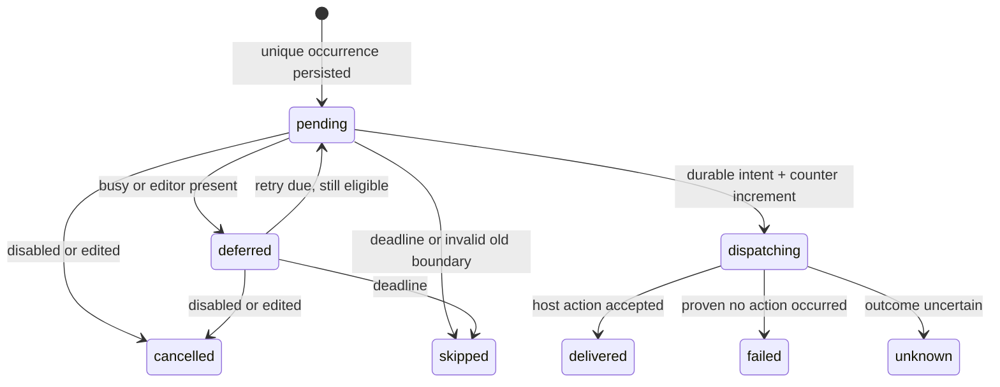

# Persistent Session wake-ups and scheduled runs (#523)

Status: **proposed contract for orchestrator approval and implementation tickets**, not implemented behavior. Baseline: `14bd501e9e87579fe410fb2b70375709f464ee12` (2026-10-02 research). [Source research and exact anchors](../research/session-automation-tessera.md) distinguish observed behavior from proposals. [Wave brief](session-automation-wave.md) and [issue #523](https://github.com/horang-labs/tessera/issues/523) define scope. Competitor findings are pending; nothing here presumes their results.

## Outcome and bounded scope

Provide opt-in rules that either (a) send a saved continuation prompt to an existing PTY Session after a confirmed lead turn settles, or (b) create a fresh PTY Session on a one-time, interval, or daily schedule. One backend Automation domain owns scheduling, admission, persisted attempts, limits, and history. A rule does not decide whether the user's work is finished.

Recommended v1: Claude Code and Codex; text-only prompts; existing live Worktree for scheduled creation; existing PTY Session for wake-up; one active rule per target Session; foreground editors block automatic wake-up. GUI/protocol execution, arbitrary cron, external triggers, auto-approval, task/issue completion inference, automatic Worktree creation, and provider-independent goal evaluation are excluded. OpenCode is an explicit follow-up because the detached launch path does not carry its model/effort selection. Unsupported provider/settings must fail validation rather than appear saved successfully.

## Small domain and invariants

- **Automation**: owner-scoped, versioned rule with explicit target, trigger, prompt, saved execution selection, enabled state, expiry, and finite dispatch limit.
- **AutomationRun**: one immutable occurrence and the audit of its dispatch attempt. Its ID is the idempotency key through scheduling and the runtime adapter. `delivered` means a host Enter write or initial-prompt launch was accepted by Tessera, never that the model complied or the task succeeded.
- **Boundary**: runtime-owned evidence for a potential next turn: server instance, terminal generation, Session binding, foreground turn sequence, and input revision. A timestamp or output counter alone is insufficient.
- **Runtime adapter**: small provider-aware layer over the existing launch and TerminalManager paths. The scheduler knows no PTY bytes, argv, transcript paths, or provider-specific hook mappings.

At most one scheduler per DB profile; at most one in-flight dispatch per rule and per Session; no permission answering; no mixing with a human draft; no unconditional replay after a possible side effect; all execution carries the recorded owner and verified agent environment. Disable/expiry stops future input, not an already-running agent. Persisted due times are authoritative; timer callbacks only request reconciliation.

## Contracts (proposed, version 1)

All times in API payloads are integer UTC epoch milliseconds. IANA zone and local time describe daily rules; server time is authoritative. IDs are opaque strings generated by the backend. Reject unknown fields. JSON stored in the DB is validated against these same contracts.

```ts
type Provider = 'claude-code' | 'codex';
type Trigger =
  | { kind: 'once'; at: number }
  | { kind: 'interval'; anchorAt: number; everyMs: number }
  | { kind: 'daily'; timeZone: string; localTime: string } // HH:mm
  | { kind: 'turn-complete'; delayMs: number };

type Selection = {
  provider: Provider;
  model: string;                    // explicit resolved model, no implicit default
  reasoningEffort: string;          // explicit supported value, not "auto"
  serviceTier: 'default' | 'fast' | null; // Codex requires value; Claude requires null
  settings: { permissionPolicy: 'inherit-cli'; allowPreparationFailure: false };
};
type Target =
  | { kind: 'create-session'; worktreeId: string; title: string; selection: Selection }
  | { kind: 'wake-session'; sessionId: string };
type AutomationInput = {
  name: string;
  enabled: boolean;
  target: Target;
  trigger: Trigger;
  prompt: string;
  limits: { maxDispatches: number; expiresAt: number };
};
type AutomationState = 'enabled' | 'disabled' | 'paused' | 'exhausted' | 'expired';
type Automation = Omit<AutomationInput, 'enabled'> & {
  id: string; revision: number; state: AutomationState;
  pauseReason: string | null;
  ownerUserId: string; agentEnvironment: 'native' | 'wsl';
  savedSelection: Selection;         // target selection or inspected Session selection
  nextDueAt: number | null;
  dispatchCount: number;             // includes unknown attempts; never reset on edit
  createdAt: number; updatedAt: number;
};
type RunState = 'pending' | 'deferred' | 'dispatching' | 'delivered'
  | 'skipped' | 'failed' | 'unknown' | 'cancelled';
type AutomationRun = {
  id: string; automationId: string; automationRevision: number;
  occurrenceKey: string; dueAt: number; deadlineAt: number;
  coalescedCount: number;            // omitted older due slots, zero for wake/once
  state: RunState; reason: string | null;
  sessionId: string | null; terminalId: string | null;
  boundaryId: string | null;
  attemptStartedAt: number | null; deliveredAt: number | null; finishedAt: number | null;
  effectiveSelection: Selection;
  agentEnvironment: 'native' | 'wsl';
  observedRuntime: 'unobserved' | 'starting' | 'running' | 'input-required'
    | 'turn-complete' | 'exited' | 'unknown';
};
```

Validation and policy are deliberately finite: name/title 1–120 characters, normalized prompt 1–32 KiB UTF-8; interval 60 seconds–30 days; turn delay 30 seconds–24 hours; maxDispatches 1–100; expiresAt after now and at most 90 days away. Once/anchorAt must be future on save and before expiry. Daily HH:mm and IANA zone must validate server-side. API returns the calculated next occurrence for UI confirmation. These numerical bounds are product proposals, not existing source constants.

Only `wake-session + turn-complete` and `create-session + once/interval/daily` are valid in v1. No idle-only wake: SessionStart idle and InterruptFallback do not prove a completed user turn. A future idle trigger must require equivalent provider evidence. Enabling a wake rule is an explicit arm action: if the adapter can prove a current clean completed boundary, schedule that boundary at now+delay (never immediately); otherwise wait for the currently running turn to complete. Unknown/dirty/starting states cannot be armed. This explicit first arm is the sole exception to waiting for a new turn; ordinary ticks never reuse an old boundary.

Save explicit provider/model/effort/tier using existing provider option definitions and capabilities; revalidate before dispatch, and pause on unsupported selection without substituting a default. Custom model IDs may be accepted only through the same explicitly supported custom-model path as normal Session creation; lack of catalog evidence is not proof of runtime availability. Codex fast is an explicit choice; never infer fast from a model. For wake rules, save the persisted Session selection and compare at admission; do not mutate a live Session's model. Label this “saved launch selection,” not verified live TUI configuration. Native TUI changes can escape persisted selection tracking; manual interaction disarms automatic continuation until explicit re-enable, with that limitation shown.

`settings.permissionPolicy=inherit-cli` means provider-native approvals/configuration remain effective at execution time, not that all CLI configuration is frozen. Arbitrary permissionMode, sandbox flags, environment variables, argv, credentials, or tool permissions are not accepted. GUI creation settings are not automatically reusable for detached PTY launch. Supporting a frozen full provider settings profile is a separate adapter contract decision; do not claim it exists.

## HTTP and internal runtime API

Use authenticated Next routes and existing origin gate, not the local Control credential as browser auth. Never accept ownerUserId/agentEnvironment from the request body. Resolve the configured server owner, require the authenticated user to match it, then persist that exact identity and strict owner settings. Other authenticated users get 403; access to another owner's rule ID gets 404. The current shared Session/Project schema does not implement per-user ACLs: v1 is intentionally restricted to the configured runtime owner. Recheck target existence, kind, live Worktree, archive/delete state, and environment compatibility on writes and dispatch.

| Endpoint | Request | Response and behavior |
|---|---|---|
| `GET /api/automations?sessionId=&worktreeId=&cursor=&limit=` | Optional target filter, limit default 50/max 100, opaque cursor | 200 `{items: Automation[], nextCursor: string|null}` owner scoped; both target filters together rejected. |
| `POST /api/automations` | AutomationInput; required `Idempotency-Key` (opaque 1–128 chars) | 201 `{automation}`; identical retry returns original object, changed body with same key 409. Validate rule before any work is scheduled. |
| `GET /api/automations/:id` | — | 200 `{automation}` or 404. |
| `PUT /api/automations/:id` | `{expectedRevision, input: AutomationInput}` | 200 `{automation}`; replace user configuration, retain counters/history; CAS conflict 409. Cancel undispatched old occurrences. Target kind/ID immutable; use a new rule to retarget. |
| `POST /api/automations/:id/state` | `{expectedRevision, enabled: boolean}` | 200 `{automation, inFlightRunId: string|null}`. Disable cancels unsent runs; enable revalidates, recomputes future due time, and explicitly arms a verified clean wake boundary or the currently running turn. Cannot enable exhausted/expired rule without valid extended limits. Unknown outcome must first be resolved. |
| `GET /api/automations/:id/runs?cursor=&limit=` | default 50/max 100 | 200 `{items: AutomationRun[], nextCursor: string|null}` newest first. No prompt or raw terminal screen in list. |
| `POST /api/automations/:id/runs/:runId/resolve` | `{expectedRevision, resolution:'acknowledge-no-retry'}` | 200 `{automation, run}`; only unknown run; record human acknowledgement, retain unknown outcome/counter, clear its overlap hold. Rule stays disabled until explicit enable. Does not resend. |

Error envelope: `{error:{code:string,message:string}}`. Codes: `INVALID_AUTOMATION` (400), `UNAUTHENTICATED` (401), `OWNER_NOT_ALLOWED` (403), `NOT_FOUND` (404), `REVISION_CONFLICT`, `IDEMPOTENCY_CONFLICT`, `ACTIVE_WAKE_EXISTS`, `UNRESOLVED_RUN` (409), `UNSUPPORTED_SELECTION` (422), `OWNER_UNAVAILABLE` (503). Do not include prompt/credentials/host private paths in errors. Mutations emit owner-only `{type:'automation_mutated', automationId, revision}`; clients refetch on event/reconnect. Polling while the dialog is open is a fallback; clients never run schedules. No manual “run now,” delete/purge, or automation CLI commands in v1.

The runtime adapter is internal, not another public prompt endpoint:

```ts
type Boundary = {
  id: string; serverInstanceId: string; terminalId: string; generation: number;
  sessionId: string; userId: string; turnSequence: number; inputRevision: number;
  completedAt: number; source: 'confirmed-lead-turn';
};
type DispatchResult =
  | { kind:'delivered'; sessionId:string; terminalId:string; at:number }
  | { kind:'deferred'; reason:string; retryAt:number }
  | { kind:'failed'; reason:string } // proven no side effect
  | { kind:'unknown'; reason:string; sessionId:string|null };
interface AutomationRuntime {
  observe(userId:string, sessionId:string): Promise<{
    boundary:Boundary|null; blockedReason:string|null;
    runtimeState:AutomationRun['observedRuntime'];
  }>;
  dispatch(args:{runId:string; leaseEpoch:number; ownerUserId:string;
    expectedRuleRevision:number; expectedBoundary:Boundary|null}): Promise<DispatchResult>;
}
```

Adapter loads immutable run snapshot itself, not caller-supplied prompt/config. `expectedBoundary` is mandatory for wake, null for create. Observation is advisory; dispatch atomically rechecks admission immediately before each irreversible action. Expected rule revision protects edits/disable races. Public Control semantics remain user-driven; add internal conditional submission rather than change every CLI prompt into an automation action.

## Persistence and migration

Use the existing server SQLite DB, not browser storage or a second JSON schedule file. Current schema is v39; backend ticket allocates the next available version at integration time, with both fresh-schema and upgrade/reconciliation paths. No seed automations; everything starts opt-in.

| Table (new) | Required data and constraints |
|---|---|
| `session_automations` | `id` PK, `owner_user_id`, `revision`, `state`, `pause_reason`, `name`, target kind/ID, `config_json` (validated input, saved selection/environment), `next_due_at`, `dispatch_count`, `created_at`, `updated_at`. Index `(owner_user_id,state,next_due_at)`; unique active wake target `(owner_user_id,target_session_id)` for enabled/paused states. |
| `session_automation_runs` | `id` PK, `automation_id` FK RESTRICT, `automation_revision`, `owner_user_id`, `occurrence_key`, immutable `snapshot_json` (prompt/selection/settings/environment/trigger/limits), `due_at`, `deadline_at`, `coalesced_count`, `state`, `reason`, `session_id`, `terminal_id`, `boundary_json`, `lease_epoch`, `attempt_started_at`, `delivered_at`, `finished_at`, `retry_at`, `observed_runtime`, `resolved_at`, `canonical_worktree_id`, `overlap_held` (0/1). Unique `(automation_id,automation_revision,occurrence_key)`; one pending/deferred/dispatching run per automation; unique canonical_worktree_id where overlap_held=1; due/retry and owner/history indexes. Session ID is retained as historical text after deletion. |
| `session_automation_scheduler` | Singleton PK `id=1`, `instance_id`, monotonic `lease_epoch`, `lease_until`, `heartbeat_at`. One scheduler for the profile, not one per browser/user/rule. |
| `session_automation_idempotency` | `(owner_user_id,key)` PK, normalized request hash, original response JSON and createdAt. Retain for rule lifetime; bounded by creation quota (100 rules/profile); same key with a different normalized body is conflict. |

All claim/advance/counter mutations use `immediateTransaction` and affected-row/CAS checks. Due indexes avoid scanning Session transcripts. Prompt text stays in local rule/run storage and owner-only detail, never telemetry. Keep full run rows for v1 (finite rules and dispatches); no pruning job that removes dedup keys. Coalesce downtime rather than create one row per missed interval. No cascading deletion of history on Session archive/delete.

A unique run reservation and its newly generated Session ID/row must commit together **before launch**. Reuse the creation adapter's validation and Session persistence/broadcast behavior by extracting a small internal “create with reserved ID in caller transaction” helper; do not invoke public create repeatedly on retries. Send mutation broadcasts after commit. Do not copy Control launch's rollback-and-delete behavior onto runs that may own a runtime.

Durability gate: current DB uses `synchronous=NORMAL`. Before enabling this feature, the backend ticket must use and verify `synchronous=FULL` for automation-writing connections (the shared connection too), or provide an equivalently durable dispatch journal. Recommended v1 is FULL on the shared DB, with measured latency noted. Otherwise an acknowledged dispatch marker may disappear on power loss and permit a duplicate. This does not make SQLite+PTY a distributed transaction; hardware/storage failure remains outside guarantees.

## Scheduler, time semantics, and recovery

One shared startup function is called by **both** `server.ts` and `electron/server-child.ts` after DB/auth readiness and WS sender binding. It acquires the scheduler lease and coordinates recovery of automation-owned Sessions; a second backend with the same profile does not dispatch or restore those Sessions. Integrate a filter into existing `restoreSessionRuntimes`: automations' unfinished/ambiguous run Sessions are recovered only by the elected adapter, never independently by the generic recovery loop. Other Session recovery retains existing behavior.

Proposed lease: random instance ID, epoch increment on takeover, 5-second heartbeat, 20-second expiry; no new dispatch when renewal fails or clock movement invalidates it. Tick at startup and at most every five seconds; use nearest persisted due time only as an optimization. On each timer resume, compare wall time to monotonic elapsed time; large discontinuity suspends active attempts, revalidates lease, and recomputes schedule. Never depend on a long setTimeout firing accurately. Before shutdown, stop claims/renewals and admission, then drain bounded in-flight operations before PTY cleanup; record uncertainty instead of failure if completion cannot be confirmed.

A stale owner must not write after takeover. The adapter rechecks epoch, lease expiry, rule revision/enabled/expiry, and runtime ownership under an immediate DB transaction immediately before the synchronous PTY paste/Enter or spawn initiation, with no await between fence check and side effect. The durable dispatch marker is committed before that section. Do not hold DB locks over the 500 ms paste delay or async preparation. Preparation returns to the fence before starting the process. Lease alone without these final checks is insufficient.

| Trigger | Occurrence key and due calculation | Restart/sleep/catch-up |
|---|---|---|
| once | `once:<at>`; due=at | If overdue by at most 24 h and before expiry, attempt once; otherwise skipped/missed and disabled. |
| interval | `interval:<anchorAt+k*everyMs>`; fixed rate, not completion-relative | Select only the latest missed slot, persist one run with coalescedCount equal to older omitted due slots, advance next_due to first future slot. Never replay a backlog; latest slot must be within 24 h and before expiry. |
| daily | `daily:<timeZone>:<local-date>` at local HH:mm | Persist resolved UTC instant. Spring-forward nonexistent time uses first valid instant after the gap; fall-back repeated time uses earlier occurrence once. One most-recent eligible missed local date within 24 h; skip older dates. |
| turn-complete | `turn:<serverInstanceId>:<generation>:<turnSequence>`; completedAt+delay | Persist due immediately on accepted completion. On backend restart, old epoch boundaries are invalid: cancel stale pending wake, pause and require explicit re-arm after a verified boundary. If same process resumes from sleep, recheck identical boundary/safety and the 24 h/expiry deadline. |

Daily policy requires a tested IANA-zone implementation; library choice remains with backend ticket (do not hand-roll offsets). Changing OS timezone must not move a saved zone rule. Editing the rule increments revision, cancels unsent old occurrences, and calculates future-only scheduling; no edit causes a retroactive burst. Clock backward movement cannot duplicate a persisted occurrence key. Daily timezone rule database updates can affect future calculations; preserve already-materialized instants and display both saved zone and UTC next due.

`deadlineAt=min(dueAt+24h, expiresAt)`. Busy Sessions/runtime admission defer the **same run** with retryAt=min(now+30s,deadlineAt); no new prompt queue entry on each tick. Permission/question, unknown lifecycle, unknown dispatch, owner/environment drift, missing/archived target, and unsupported selection pause the rule with a reason. Permission resolution alone does not re-enable it. Explicit enable cancels any undispatched paused occurrence before calculating a future schedule or a newly armed boundary; it cannot revive an expired old run. Missing runtime for a wake pauses; never automatically restart a Session explicitly stopped by its user. Disable cancels pending/deferred rows; any run past the irreversible boundary is reported inFlight and observed, not undone.

## State, overlap, and delivery protocol



`finishedAt` means this dispatch audit reached a terminal state; it is not agent-task completion. `observedRuntime` continues updating for delivered runs. Increment dispatchCount once when entering dispatching, including failed/unknown attempts; pre-admission deferrals do not consume it. At maxDispatches, no additional dispatch; set exhausted after recording current outcome. Expiry/limit checks also run at the final admission fence. Do not auto-retry failed/unknown dispatch attempts; fix and explicitly enable for future occurrences. Recover pending/deferred entries only if no dispatch marker exists; recover dispatching as unknown, unless a durable delivery record already exists. Never infer “not delivered” from absent transcript text.

Overlap: one unfinished attempt per rule; a delivered creation run holds the next occurrence while its Session is starting/running/input-required or runtime status is unknown. Release its hold only on a confirmed settled turn or confirmed natural runtime exit, labelled as observation, never success. Explicitly stopping a run Session disables that rule. Unknown delivery holds overlap until human acknowledgement. A confirmed completion allows later scheduled creation even if the old PTY remains idle; this policy avoids using process existence as perpetual overlap. It does not prove background work finished, so provider adapters must reject boundaries with known working children; providers with insufficient foreground/background evidence remain unsupported for automatic release. A wake rule's next run requires a fresh accepted turn following its previous delivery, never repeated ticks on the same completed snapshot.

When later slots become due while a deferred occurrence exists, keep the current occurrence/deadline and coalesce further missed slots at the next advancement; do not accumulate rows. Creation rules sharing one Worktree additionally reserve overlap_held on the run under the same claim transaction, protected by the partial unique canonical Worktree index; retain that reservation across delivered-but-active and unknown states, and release under the observation/acknowledgement rules above. A cancelled/skipped attempt before runtime ownership, or a failed attempt proven to have caused no external action, releases overlap_held in the same finalization transaction; there is no runtime to observe in those cases. If a runtime/action may exist, retain the reservation and classify unknown instead of failed. They also reuse the existing preparation gate; v1 blocks automatic overlapping **automation-created** active turns in the same canonical Worktree. Existing human Sessions are not assumed exclusive Worktree owners; filesystem conflicts with independent human work remain visible product limitations, not a promise of isolated branches.

New Session dispatch sequence: validate owner/target/selection → transactionally reserve run+Session ID/row → preparation through providerLaunchModule → final fenced launch with saved initial prompt → delivered or unknown. A SessionStart hook alone is not proof that the initial prompt was accepted. Recovery resumes the same Session without passing initialPrompt again and retains an unknown dispatch status if acceptance was ambiguous. Restoring a runtime must never create a second Session for the same occurrence. If another backend may still own the runtime, pause for reconciliation instead of taking over its PTY from lease expiry alone.

## Safe PTY boundary and human input

Current semantic send (TerminalManager 1477) checks readiness and serial submission, then pastes and sends Enter; it does not guard running, permission, or drafts. Implement an internal `submitAutomatedSessionPrompt` around the same normalization/bracketed-paste/delayed-Enter machinery, with a distinct strict admission policy. Do not approximate this by calling `read` then public `prompt`.

The accepted-state observer belongs in TerminalManager where hook events, inferred input events, exit, and rebound converge. Hook `recordSessionState` currently notifies waiters but not the general callback; wiring only that callback misses hooks. Provider adapters supply whether the event is a confirmed lead turn end and whether children are known working. Exclude SessionStart idle, InterruptFallback, StopFailure/error ends, unknown Codex origin, permission/question states, stale terminal/generation, and conversation rebound/reset. Server turnSequence increments only for a new accepted foreground submission; repeated Stop cannot create multiple boundaries. Persist occurrence creation synchronously with accepting its boundary; if recording fails, disarm rather than remember a due time only in RAM. Ambiguous or reordered hook evidence fails closed; do not invent provider acknowledgement from ANSI output.

For v1, background-only wake is the conservative input policy:

1. Require a live owned matching runtime; exact boundary token; no running children, prefill, semantic submit, permission/question, or queued/manual input; rule still armed and enabled. Require zero attached PTY subscribers **and zero registered editable chat surfaces**. Output silence is never evidence of an empty prompt.
2. Add a server-owned input/admission gate per Session covering raw `write`, `submitSessionInput`, ChatView semantic send, named Control keys, provider prefill, attach, and conversation reset/rebind. Manual input disarms wake before its bytes are forwarded. Dirty/unknown state is sticky; disconnect, elapsed quiet time, or surface detachment cannot clear it. Manual interaction pauses the rule; re-enable explicitly after the human turn settles (or while that verified submitted turn is running). Raw keys alone do not clear dirty state: only an accepted foreground submission followed by a confirmed completed boundary can do so. If prompt emptiness remains unknown, refuse re-enable. A newly created rule can be armed during a verified running turn; its later completion is the first eligible boundary.
3. Chat/PTY editors must acquire a registered editing presence before enabling input, including Peek/popout; release only on disposal with no pending submit. A lost connection marks presence unknown and pauses the rule; TTL expiry does not prove a draft was empty. Nonempty local drafts remain preserved and are shown after reconnect. Existing unregistered clients are conservatively treated as blocking editors.
4. Automation reserves the gate before paste. A new attach/editor registration waits until this bounded operation completes, and no editor becomes interactive meanwhile. Control/manual sends competing after reservation return explicit busy and preserve caller input; they are never queued invisibly or dropped. Already-attached editors would have blocked the reservation. Device replies may pass only through the existing classifier's non-user response path.
5. Persist dispatching before paste. Recheck identity, lease, revision, expiry, state, and input revision immediately before paste and again before Enter after delay. A new permission/running event or invalidation after paste cancels Enter, records unknown, pauses, and exposes the partial paste for manual recovery. Never auto-clear terminal input with guessed control sequences. Release the gate with an explicit delivery/uncertainty result; a newly attaching user sees that state before typing.
6. Enter accepted by the host write path records delivered. Callback/log/snapshot errors after Enter must not convert this to retryable rejection (matching the current semantic method's irreversible boundary). Crash before the durable result leaves unknown and is not automatically replayed.

This policy intentionally postpones wake-ups while a user watches an editable Session surface. A later foreground mode needs explicit empty-draft/editor acknowledgements and a provider prompt boundary; it is not a hidden UI-only relaxation. Lossy hooks still limit confidence even with the gate: unsupported provider/version combinations must remain disabled until the QA matrix establishes their input-boundary contract. No provider approval is ever answered by automation.

## UI and observability

Reuse Header/ChatArea extension points for a shared Automation dialog and status chip in both normal panel and Kanban Session Peek. A Worktree action opens the scheduled-creation form. Session action opens wake settings. Form exposes name, saved prompt, trigger, timezone/next run preview, provider/model/effort/tier for new Sessions, finite count, expiry, and enable/disable. Show inherited CLI permissions explicitly; unavailable fields are not silent no-ops.

Chip/dialog show enabled/paused/expired/exhausted, next due or “waiting for next confirmed turn,” dispatch count/limit, blocked reason, and history with scheduled time, host delivery outcome, runtime observation, and Session link. Distinguish delivered, unknown, failed, skipped, and completed turn. Unknown offers acknowledgement without retry; automatic resend is absent. Disable remains available while in-flight with a clear inFlight result. Missed/coalesced schedules and disconnected owner/engine state are visible. Do not show “task succeeded.”

UI presence registration is owned by the runtime-adapter ticket at the shared input boundary; feature UI reads the contract. Use existing owner WS mutation patterns; an inactive or closed renderer does not stop the engine. HTTP mobile contexts must use an ID fallback/library where client request IDs are needed, not assume crypto.randomUUID exists.

Persist state transition timestamps/reason codes for history. Structured logger fields: automationId, runId, ownerUserId, ruleRevision, leaseEpoch, target Session ID, due lateness, admission reason, duration, outcome. Count due/deferred/delivered/unknown, duplicate claims prevented, lease loss, and missed slots. Do not log saved prompt, terminal screens, tokens, or raw paths; PTY latency collection stays off unless explicitly requested. WS/history publication failure must not replay a delivered run.

## Implementation split and acceptance seams

These are proposed tickets, not created GitHub issues. Orchestrator owns final IDs, dependency edges, integration, and bookkeeping. Freeze contracts first; B and C can then proceed independently with fixtures while A builds persistence.

| Ticket | Ownership/minimal overlapping files | Dependencies and acceptance |
|---|---|---|
| A — Automation engine, persistence, API | New `src/lib/automation/{contracts,schedule,repository,engine,service,startup}.ts`, new `/api/automations/**`, DB schema/database migration, both server entrypoints, WS message type/mutation integration | Depends on approved #523 plus sibling research decisions. Own due-time/DST semantics, durable occurrence/counter/lease CAS, auth, API, FULL durability decision. Fake clock + real temporary SQLite tests for crash claims, restart/sleep, duplicate instances, disable/edit races, ownership, expiry, limits. No direct PTY writes. |
| B — Conditional PTY dispatch/runtime integration | New `src/lib/automation/runtime-adapter.ts`; TerminalManager and shared manager; provider launch module + small reserved-ID creation helper in control/session-mutator; session-runtime-recovery coordination; shared terminal input/edit presence components and WS routing | Depends on approved contracts; integrates A service after both land. Own all changes to existing input files, hook observation seam, cross-process runtime recovery exclusion, and provider capabilities. Tests interleaved human/permission/rebind during delayed Enter, stale epoch, partial paste unknown, no initial prompt replay, exact saved selection and userId/environment propagation. |
| C — Automation forms and history UI | New `src/components/automation/**`, `src/stores/automation-store.ts`, Header/Worktree menu insertion, i18n messages | Depends on approved API; develop against fixture API independently. No TerminalManager/WS-routing edits; B supplies input presence. Tests validation, timezone preview, stale revision, paused/unknown history, safe enable/disable and preserved drafts in panel/Peek. |
| D — Integration and packaged QA | Dedicated automation integration/e2e tests and QA evidence/report; integration fixes assigned back to owning A/B/C | Blocked by A+B+C. Verify actual packaged Windows server + WSL CLI, restart/sleep, lease competition in isolated profiles/fixtures, dedup, settings fidelity, ordinary panel+Peek, popout if affected, HTTP mobile ID fallback. Ordered screenshots from initial state through every interaction/error/final result copied to Windows Downloads; no normal profile. |

A owns central WS message types and startup order; B provides the precise observer/presence message changes to A as a small coordinated contract patch to avoid simultaneous edits. B owns existing input component edits; C only adds configuration UI and status integrations. Do not allocate the next schema version independently in more than one ticket.

TDD is applicable to future code at pure schedule calculation, immediate-transaction claims/idempotency, the conditional runtime admission seam, and API ownership boundaries. Test behavior under competing events, not source-string mirrors. For this research ticket, no executable behavior changed and no agreed executable seam exists, so TDD/typecheck/lint/full suite do not apply. Future implementation tickets run targeted tests, typecheck and lint; D must verify the exact packaged topology rather than infer it from a Windows-looking shell using TESSERA_DEV_PORT.

## Decisions for the orchestrator

Recommended defaults above form one implementable v1; explicitly resolve these before issuing implementation tickets:

1. Accept background-only wake admission and no idle trigger, or fund the larger foreground draft acknowledgement design. A cannot enable wake without B's gate and provider evidence.
2. Accept Claude/Codex-only launch selection and inherited CLI permission settings. Supporting OpenCode/frozen permission profiles needs a provider contract expansion; do not silently promise those settings.
3. Accept finite limits (100 attempts/90 days), 24-hour coalesced catch-up, explicit re-enable after permission/unknown state, and same-Worktree automation overlap prevention. UI should communicate these defaults.
4. Accept conservative unknown delivery/no automatic resend and FULL SQLite durability, including storage/latency limitations. Exactly-once provider execution is not promised.
5. Confirm runtime-owner-only product scope; multi-user ACLs are a separate prerequisite to lifting that restriction.
6. Confirm provider boundary support with packaged QA and fold in sibling competitor findings. Missing hook/child-work evidence, current effective TUI settings, time-zone implementation, and power-loss behavior remain unverified here.
