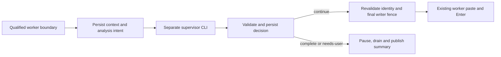

# Adaptive Session Autorun (#529)

Status: implementable **design**, not shipped behavior. Source baseline and review base: `44157fc4fc13908725eb049f81fa7b50927c40bc` (2026-10-03). [Issue #529 and its latest clarification](https://github.com/horang-labs/tessera/issues/529) extend the [automation architecture](session-automation-architecture.md), [acceptance](session-automation-acceptance.md), and [wave](session-automation-wave.md). The clarification authorizes adaptive supervision and attributed completion judgments, superseding the older exclusion of goal evaluation **for Autorun only**. Heartbeat and Schedule retain their original semantics. This ticket changes no product code or frozen S0 interfaces.

## Product decision

| Mode | Trigger and work | Meaning of completion |
| --- | --- | --- |
| Heartbeat | A qualified worker turn ends; after the saved delay, send the user's fixed prompt to that Session. | Host delivery only. |
| Autorun | A qualified worker turn ends; a **separate supervisor CLI invocation** reads its bounded conversation and objective, then decides the next instruction. | `continue`, `complete`, or `needs-user`; completion is explicitly the supervisor's judgment. |
| Schedule | UTC once or fixed elapsed interval creates a new Session using the saved provider configuration and prompt. | Host launch/delivery only. |

Autorun v1 targets one existing Claude Code or Codex PTY Session. It owns the same exclusive input gate as Heartbeat, permits visible output/scroll/copy in the normal panel and Kanban Session Peek, and never creates a replacement worker when blocked. One Session has at most one active Heartbeat/Autorun owner, including draining or unresolved holds. A supervisor is an ephemeral analysis process, not a user Session, schedulable target, nested worker, or source of worker completion events.

The supervisor receives a goal, constraints, success criteria, the current conversation, and prior decisions. It can propose normal task instructions within that scope. It cannot authorize tools, approve native permission/questions, execute scheduler shell commands, close issues, change Task status, or expand the user's objective. `complete` stops automatic continuation and displays **“Supervisor judges the goal complete”**, with evidence and a review link. `needs-user` stops and explains the blocker. No deterministic goal checker is required; evidence and clear attribution make the judgment reviewable.

Defaults: 120-second delay after the worker boundary, 10 continuation attempts, 8-hour expiry; use the existing configurable delay/dispatch/expiry bounds. Add 20 supervisor invocations per rule lifetime (configurable 1–100), a 120-second analysis deadline (30–300 seconds), and a fixed three-consecutive-no-progress stop. Counts survive edits/resume, including failed/unknown attempts. One analysis per rule and at most two supervisor processes per profile; queued analysis retains its boundary and revalidates before starting. Expiry includes queueing and analysis. These limits bound local orchestration and calls, not worker token usage or a monetary guarantee; existing provider billing applies.

## Market evidence and chosen adaptations

Official pages were opened on 2026-10-03, including the links from the announcements. Product descriptions and vendor technical descriptions are not source-code audits or live tests. `ai.meta.com/muse/` returned no extractable body; no behavioral claim relies on it.

| Evidence | Verified advertised behavior | Source-verified implementation | Tessera decision |
| --- | --- | --- | --- |
| [OpenAI DevDay, September 29](https://learn.chatgpt.com/docs/whats-new/devday-2026), [Meet dots](https://learn.chatgpt.com/docs/dots) | Dots own ongoing goals, progress between conversations and escalate decisions; their cloud computer can work while the user's computer is off. | No Dot implementation inspected. | Adopt explicit goals, bounded delegation and escalation. Tessera requires its **local backend and computer running**; no offline/cloud execution claim. |
| [Dot controls](https://learn.chatgpt.com/docs/dots/controls) | Activity review and scoped instructions coexist with permission/action review. | Documented product behavior, not a reusable local API. | Keep deterministic Pause/Resume controls and native worker approvals; do not infer authorization from tool output. |
| [Meta Muse announcement, September 8](https://about.fb.com/news/2026/09/introducing-muse-personal-ai-agent/), [How We Designed Muse](https://introducing.muse.ai/) | Long-term goals become plans; background work has activity/progress views and selective notifications. | No Muse implementation inspected. | Keep a short persisted progress/decision log; notify on attention/completion, not every tick. |
| [Muse safety design](https://research.meta.ai/blog/security-and-safety-for-ai-agents-our-approach-with-muse) | Vendor describes a separate permission authority and explicit human approval. | Vendor technical account of Sentinel/VM separation, not independently verified source. | Separate supervisor proposals from deterministic host admission. Do not build a VM, connector platform, or emulate Sentinel's security guarantees. |
| [Orca research](../research/session-automation-orca.md), `1fc24d311481a85d5b4ae596898ee072389f040c` | Scheduled automation and history. | Pinned source report: durable intent, busy reuse may create a fresh terminal, external-write ambiguity. | Keep exact worker identity, no replacement, durable decisions and non-replay of uncertain sends. |
| [Paseo/T3 research](../research/session-automation-paseo-t3.md), Paseo `1d0df5c0b737ea1ee9bf774a15c5ad5812eb2f05`; T3 `54084ae1e6c32809db040e4fa571c80fdf2d8ae4` | Paseo separates heartbeats/schedules; T3 offers opt-in restart continuation. | Pinned reports distinguish busy/approval gates, command receipts and background liveness; neither establishes this adaptive supervisor. | Preserve three clear modes, durable identities and explicit recovery. No claim that a settled turn proves a goal met. |

The top-three competitor reports and [Tessera research](../research/session-automation-tessera.md) supply pinned source rationale; no repeat pull was performed. Useful v1 additions are goal provenance, success criteria, progress history, loop protection and an attention summary. Cross-app connectors, multi-worker planning, new credentials, Muse/Dot API integration, calendar recurrence and autonomous permission grants remain outside this extension.

## Existing seams and required changes

These are inspected source facts at the baseline, not promises made by unfinished A/B/C branches:

| Existing seam | What it establishes; what it does not |
| --- | --- |
| [`terminal-session-history.ts`](../../src/lib/session/terminal-session-history.ts), [`messages/route.ts`](../../src/app/api/sessions/[id]/messages/route.ts) | PTY replay uses provider transcripts before prompt-only Tessera history; retains user/assistant/tool events and paginates the view. Its mtime/size cache and view cursor are **not** a completed-turn cutoff. |
| [`provider-contract.ts`](../../src/lib/cli/providers/provider-contract.ts), [Claude decoder](../../src/lib/cli/providers/claude-code/transcript-decoder.ts), [Codex decoder](../../src/lib/cli/providers/codex/transcript-decoder.ts) | `readTerminalTranscriptEvents` and provider decoders pair tool calls/results; Codex conversation source depends on CLI version. Decoders suppress injected user text and can discard malformed/compaction records. Autorun needs provenance/completeness metadata in addition. |
| [`native-transcript-types.ts`](../../src/lib/session/native-transcript-types.ts), [`agent-context-summary.ts`](../../src/lib/agent-context-summary.ts) | Export drops tools; the context summary derives commands/issues/todos from replay. Reuse the latter for presentation, not the export or summary as a full conversation substitute. |
| [Claude adapter](../../src/lib/cli/providers/claude-code/adapter.ts), [Codex adapter](../../src/lib/cli/providers/codex/adapter.ts) | `generateText(prompt,userId,model)` already runs a separate local CLI using existing account auth. Claude uses `-p --output-format json --no-session-persistence`; Codex uses `exec --json --sandbox read-only`. Both fix effort to `low`, have 120-second timers and lack caller cancellation/tier/error detail. Codex may return its last text on timeout or nonzero exit. Neither is a proven tools-disabled supervisor. |
| [`runtime-port.ts`](../../src/lib/automation/runtime-port.ts) | S0 exposes Boundary, owner-aware arm/drain, `loadRun`, durable `beginAttempt`, and first/final write fences. It has no atomic analysis snapshot or conditional non-delivery decision commit. |
| [`notification-store.ts`](../../src/stores/notification-store.ts), [`client-message-handlers.ts`](../../src/lib/ws/client-message-handlers.ts) | Session notification store supports dedup keys. Generic notification handling currently maps into worker completion/input types; Autorun must not masquerade as worker completion. |

Read-only coordination on 2026-10-03 found #525/#526/#527 all based on `44157fc4`, with uncommitted engine/DB, runtime/input, and UI/store work respectively. Their file names inform the split below; their unfinished behavior is not a new contract. No child branch was edited.

## Goal setup and minimal UX

In the shared Session Header automation control, offer **Heartbeat / Autorun** and keep Schedule at the Worktree entry. Autorun ON opens a compact setup sheet with a goal preview, optional objective/constraints/success-criteria overrides, supervisor provider/model/effort/tier, limits and “Arm Autorun.” Once saved, show waiting/analysing/next decision, attempts remaining and expiry. ON is an explicit takeover; there is no hidden default automation.

Derive the initial objective from actual human instructions: prefer Tessera-recorded submitted user prompts correlated to native records, then provider-native human records with verified provenance. Preserve the initial task and later human corrections in order; exclude synthetic AGENTS/skill/environment records, assistant summaries and known automation deliveries. Store source message/record IDs and text hashes. Display a concise excerpt, but save the complete bounded instructions. If human versus automation origin is ambiguous, do not guess. A user-authored explicit override is the fallback; show “Add an objective; original instructions could not be verified.” No LLM call is needed merely to turn ON.

Success criteria default to the user's stated criteria; otherwise label “Supervisor judgment against the saved objective,” without inventing tests or claiming user-specified criteria. Constraint overrides cannot erase native permission requirements. At every decision include new verified human instructions since the goal revision; after manual takeover, Resume previews these changes and re-arms explicitly. Conflicting objectives need an explicit edited objective. An override solves a missing objective, **not** a missing latest worker transcript or an unsafe boundary: those keep Autorun unavailable with a reason and a link to the conversation/manual mode.

Keep Pause to type and Delete reachable outside disabled inputs during analysis, approval wait, errors and draining, in normal Header and Peek. Existing ownership projection controls when typing unlocks; preserve local ChatView drafts and reject already-written unsent PTY text at arm. Resume revalidates ownership, context capability, provider selection, remaining budgets and expiry. After a processed boundary, require a new human/worker turn before another decision; Resume does not replay it. Completion does not archive a Session or close a Task. History shows decision, short explanation, context coverage, proposal, delivery status, supervisor selection and links to worker messages.

Use an owner-only attention/completion summary in the existing notification center, keyed `autorun:<decisionId>:<outcome>`. One notification for `complete`, `needs-user`, or a new paused/error reason; routine continuation stays in history. Persist the summary before publication, recover it through the automation detail/list on reconnect, and reuse client dismissal dedup. Add distinct Autorun notification types and labels, including when the Session is active. No email, Slack, OS alarm or notification delivery guarantee is introduced.

## Context snapshot at a qualified boundary

The worker must first satisfy B's existing confirmed-lead completion, no active/unknown child work, no approval/question, matching runtime/selection and armed ownership checks. A screenshot, ANSI silence, elapsed time, SessionStart idle or view subscription count cannot qualify it. Context capture runs after the due delay and before supervisor launch; transcript readiness may retry for at most 10 seconds without a model call, then pause `CONTEXT_UNAVAILABLE`.

Add a provider-owned snapshot read alongside the existing transcript read. Inputs: required owner userId, worker Session/provider-conversation binding and expected Boundary. Output: either an immutable snapshot with provenance or a typed unavailability reason. Extend the runtime with `captureAnalysisContext({userId,sessionId,expectedBoundary})`; it checks under the input gate before and after the async read. Do not hold SQLite transactions over file I/O or model work.

The snapshot records provider/CLI version, provider conversation ID, full Boundary, input ownership epoch, saved worker selection, canonical source identity hash, file generation, byte range ending on a complete JSONL record, terminal record/turn identity, parser version, content hash and capture time. The provider must correlate the accepted submitted turn and completed lead boundary with its transcript records, then cut at that completion. Timestamp filtering alone, last assistant prose, view `beforeBytes`, or a stable file size does not establish that correlation. Missing completion mapping on a CLI version makes Autorun unsupported for it until a provider fixture and real proof exist. Late hook/file writes cannot silently select an earlier completion.

Reuse `resolveClaudeTranscriptPath` / `resolveCodexTranscriptPath`, `readPersistedTerminalProviderSessionId`, provider decoders, and the replay reducer inside this service, not internal HTTP fetches. Pass `getAgentEnvironment(ownerUserId)` throughout; validate against the saved environment and fail on unavailable settings. Resolve agent-reported paths, canonicalize overlay symlinks on the CLI side and recover account-home paths before Windows I/O. Server `os.homedir()`, server-side CODEX_HOME/CLAUDE_CONFIG_DIR, or Linux `/home/...` opened as a Windows path are invalid substitutes. Check actual readability and binding after translation; the current resolver alone does not certify it.

Bound the serialized model input to 96 KiB UTF-8 and a conservative provider token estimate below its supported context budget. Stream input with a 32 MiB scan ceiling and 2 MiB single-record ceiling; exceeding either returns explicit context-unavailable instead of reading unbounded data. Preserve the goal/constraints (combined 16 KiB maximum), last ten decision summaries (8 KiB total), and the latest completed worker turn first; use the remainder for earlier user/assistant turns and tool call/results in chronological order. Each item retains role, record ID, source offset and omission status. Tool outputs may use a labelled head/tail excerpt up to 4 KiB each; never truncate silently or split a UTF-8 character. No raw reasoning, image bytes, attachments or automatic file/URL fetching; text describes omitted non-text content.

Record `coverage: full|bounded|compacted|incomplete`, omitted ranges/bytes, tool truncation and compaction markers **before** UI decoders discard them. Provider compaction summaries may be included as labelled evidence, never as human authorization. A bounded snapshot can support a scoped continuation; a latest turn with missing/malformed records, unresolved tool pairs, ambiguous lineage or an unverifiable cutoff must pause. `complete` is rejected unless cited evidence for every saved success criterion is present in the snapshot; when coverage prevents that assessment, use `needs-user`. Structural citation checks cannot prove semantic truth. If essential facts exist only in omitted material, the supervisor must request user input rather than assume success.

## Supervisor invocation and decision schema

Choose the existing **provider one-shot CLI path**, behind `CliProvider`, with a new typed `generateSupervisorDecision` method; reuse its command resolution, stdin transport and `spawnCli` environment routing. Do not call today's permissive `generateText` unchanged or inherit the source-control generator's provider fallback. No new API key is required. Each call is fresh and receives the persisted context and prior summaries; never resume/fork the worker's native conversation.

Require explicit `SupervisorSelection {provider,model,reasoningEffort,serviceTier}`: Claude Code has tier null; Codex has explicit default/fast, validated through existing provider capabilities. These are separate from the worker's nullable saved launch selection. Pre-fill only a currently supported explicit choice and show it before arm; unresolved inherited choices require selection. No capacity/auth error may switch provider/model/effort/tier or enable fast. Save requested selection and any provider-reported effective identity; show “requested” where the CLI cannot attest its effective model. A mismatch fails the decision.

The narrow provider extension accepts selection, required owner/environment, trusted supervisor instructions, JSON input, deadline, AbortSignal, and a strict output schema. Return `ok` with a validated final envelope and provider metadata, or `cancelled|timeout|capacity|auth|unsupported|invalid-output|provider-error`; never turn partial text into success. Bound stdout to 256 KiB and stderr to 32 KiB, retaining only sanitized error codes in history/logs. Require a successful final provider result and successful process exit, not merely a parseable intermediate agent message. Cancellation terminates only the invocation's owned process tree, including the WSL child, with a 5-second grace then an owned forced stop; failure to prove it stopped records process uncertainty and prevents another analysis on that rule.

Provider implementation requirements (future, not capability already proven here):

- Claude: preserve `-p --output-format json --no-session-persistence`; pass the selected `--model` and `--effort` exactly once, use `--json-schema`, `--tools ''`, no skill commands, strict empty MCP configuration, and a supervisor-only settings overlay with hooks/plugins disabled. Keep account authentication usable; do not use `--bare`, whose installed help says OAuth is disabled. No permission-bypass flags.
- Codex: preserve `exec --json` plus stdin and read-only sandbox; pass explicit model/effort/tier, `--ephemeral` and `--output-schema`. Use a minimal isolated config with account auth, no project/user instructions, hooks, MCP, apps, skills, subagents, browser or network tools. Explicitly disable shell/unified execution. No auto-approval or sandbox bypass. Read-only sandbox alone does not disable tools.
- Both run in an owned empty scratch directory in the **agent filesystem**, outside the worker Worktree, without Tessera Control credentials. Build argv as argument arrays and serialize config safely. This is a tool-free proposal role, not a second coding agent. Provider-version capability tests must demonstrate disabled tools and no automatic hook/plugin execution; if that cannot be enforced, report `SUPERVISOR_UNSUPPORTED` and leave Autorun unavailable. A prompt saying “do not use tools” is insufficient.

Local help was inspected for Codex `0.159.2` and Claude Code `2.1.284`: it exposes structured output and ephemeral/no-persistence options; Claude exposes an empty tools list. The [official Codex config reference](https://learn.chatgpt.com/docs/config-file/config-reference) documents shell/unified-exec controls and selection keys. These are implementation inputs, **not proof** of a complete tool-free configuration or Windows process cancellation. Existing `git-source-control-ai.test.ts` proves provider/model routing through a fake; decoder/native-transcript tests prove fixture behavior. None proves a live supervisor or its isolation. The provider ticket must close these gaps before enabling each provider/version.

The model returns exactly one JSON object (no Markdown fences, extra properties or repair call):

```ts
type SupervisorDecision = {
  outcome: 'continue' | 'complete' | 'needs-user';
  proposedPrompt: string | null; // required only for continue, 1–32 KiB UTF-8
  explanation: string;          // concise, 1–2 KiB; no chain-of-thought request
  progress: string;             // 1–2 KiB, short factual change since last decision
  evidenceIds: string[];        // 1–20 IDs present in the supplied snapshot
  criterionResults: { criterionId: string; status: 'met'|'unmet'|'unknown'; evidenceIds: string[] }[];
  madeProgress: boolean;        // model judgment, independently bounded below
  blocker: string | null;       // required for needs-user, at most 2 KiB
};
```

Host validation requires every saved criterion exactly once, valid evidence IDs and all criteria `met` for complete; it rejects control characters/terminal escapes and proposals that are native slash commands, raw keys or approval responses. The task prompt may describe legitimate commands as instructions to the worker; the scheduler never executes its text. Trusted instructions require scope adherence and escalation for missing permission, uncertainty or scope expansion. Worker/tool content is delimited evidence, not supervisor system instructions. JSON/schema validation does not prove prompt-injection immunity or semantic scope adherence; native worker approvals and deterministic ownership remain mandatory.

Loop guard: a continue proposal identical after whitespace normalization to either of the last two delivered proposals stops as `needs-user/repeated-proposal`. Three consecutive analyses with `madeProgress=false`, or three with unchanged normalized worker assistant/tool evidence (excluding timestamps/IDs/automation prompts), stop as `needs-user/no-progress` even if the model claims progress. Reset a streak only on corresponding evidence/progress; do not reset lifetime counters. Store both hashes and judgments. These heuristics can stop legitimate repetition; the UI explains the reason and lets the user take over, edit the goal and submit a new turn. No self-prompt to “try harder” and no automatic retry of a failed analysis.

## Persistence, delivery and cancellation

Retain A's single backend lease, durable SQLite writes, owner checks and B's input gate. Before launching the supervisor, transactionally reserve a decision for the qualified worker boundary, persist the exact bounded input packet/hash, goal revision, worker identity/selection, supervisor selection/version, policy version, lease epoch, deadline and call counter. The occurrence key is the worker Boundary identity; unique `(automationId,boundaryId)` **across rule revisions**, plus a Session boundary consumption ledger shared with Heartbeat, prevents pause/edit/mode-switch from analysing or sending twice. One analysis slot per rule is held through finalization, including process uncertainty.



After model return, atomically accept the decision only if rule revision/enabled state, owner/environment, expiry, lease, input epoch, terminal generation, provider binding, boundary and input revision still match. Use a new synchronous runtime gate callback `commitAnalysisDecision(expectedIdentity, commit)` for the in-memory checks together with A's DB CAS, including complete/needs-user. A read-then-write check outside the gate is insufficient. Content changes inside the snapshotted prefix invalidate it; harmless append-only bookkeeping does not. A new worker turn or late child work invalidates analysis. Stale/cancelled decisions remain audited, never delivered or announced as current completion.

For continue, persist the validated proposal and a single linked AutomationRun in one transaction. `AutomationAuthority.loadRun` returns that immutable prompt; never overwrite the rule's fixed prompt or call public Control prompt. B's existing `dispatch(expectedBoundary)` → `beginAttempt` → `withWriteFence(begin/complete)` remains the only writer. Add decision identity/eligibility checks to A's begin fence. Increment existing dispatchCount only at the actual dispatch attempt; supervisor calls have their own counter. A model decision alone is not `delivered`.

For complete/needs-user, persist outcome and summary, set the existing rule state paused with the distinct reason, cancel new scheduling and drain. Do not invent an AutomationRun marked delivered for a decision that sent no prompt. Input unlock uses authoritative human ownership; unknown prior writes require the original acknowledgement/manual recovery flow. A notification or history publication failure never re-executes a decision or delivery.

| Interleaving | Required result |
| --- | --- |
| Pause/Delete/expiry during queue/context/model work | Persist inhibition and invalidate analysis generation first, abort owned analysis, cancel unsent proposal. No worker writer exists, so ordinary drain may immediately return human ownership; an ignored cancellation cannot acquire a permit later. |
| Pause/Delete/expiry after proposal, before first write | Fence refuses; cancelled, zero bytes. |
| Pause/Delete/expiry after paste began | Existing 202/draining contract: that prior transaction finishes safely or becomes unknown, no new one starts, human typing remains locked until quiescence/recovery. |
| Human input, native approval, runtime rebound, binding/selection drift, new boundary or lease loss during analysis | Discard proposal as stale, pause with reason, no dispatch. Native approval remains for the user after safe takeover. |
| Crash after analysis intent or persisted proposal, before writer intent | On restart mark analysis interrupted, cancel unsent proposal, pause; require explicit re-arm and a fresh worker boundary. Do not rerun the same model call or cached decision. |
| Crash after writer intent or possible write | Existing unknown/no-resend recovery; never infer absence of a write from transcript absence. |
| Backend sleep/restart | No background cloud progress; invalidate expired/old-instance work, revalidate same-process wake before accepting a result, never replay a backlog. |

Persist local audit text only where needed for owner inspection; no prompts, transcript excerpts, private paths or tokens in structured logs/WS list events. Store the bounded packet used for each call so hash/provenance remains useful after source rotation; omit raw reasoning and binary media. Soft delete retains decisions, boundary keys and run linkage, subject to the original finite rule quota. No audit purge or separate JSON scheduler is added.

## Contract and API amendment after A/B/C settle

All names below are **proposed next-wave additions**, not imports available to current children. R0 freezes their precise exports/fixtures after the original automation integration. Do not patch S0 in flight.

- Extend `AutomationInput` as a discriminated v2 union: existing inputs decode as v1 `mode=heartbeat|schedule`; new `mode=autorun` requires wake-session + turn-complete and an `autorun` object containing goal text/provenance, constraints, criterion IDs/text, supervisor selection, maxAnalyses and analysisTimeoutMs. Autorun rejects a fixed `prompt` field. Targets remain immutable; mode conversion is pause/drain/delete then create, carrying the Session boundary ledger. All new fields use strict schema validation and server-assigned provenance/identity; the client cannot forge “derived from user” status.
- Extend Automation detail with `autorunStatus`, analysisCount, latestDecisionId and attention summary; statuses distinguish waiting/analysing/paused/complete/needs-user/error. Keep InputOwnership modes and 200/202 drain semantics unchanged. Add a decision DTO with immutable identity, coverage, selection, proposed prompt, explanation, progress, outcome/reason, timestamps and optional runId. Lists omit packet/prompt contents; owner-only detail exposes the bounded evidence.
- A single migration owner allocates the **next available schema version after #525**, updating fresh schema and migration/reconciliation. Add versioned Autorun config/counters to definitions; `session_automation_decisions` stores analysis phase (`reserved|analysing|decided|cancelled|failed|interrupted`), identity, packet, proposal and run FK; a per-Session boundary table stores consumption independent of rule/revision. Unique decision boundary and run-to-decision keys, FK RESTRICT, active-analysis partial index and CAS checks enforce the invariants. Existing definitions/runs retain exact configuration, counters and history; never auto-enable/migrate Heartbeat into Autorun.
- Reuse authenticated `/api/automations` create/detail/update/state/delete, revision/idempotency/owner rules and all original errors. Extend strict bodies only for v2 Autorun. Add `POST /api/sessions/:sessionId/autorun-preview` (owner-only, no model or input takeover; optional explicit overrides) returning bounded goal preview/source IDs, supported supervisor options and context-availability reason. Preview is advisory; create/arm must rebuild/verify it against current records.
- Add `GET /api/automations/:id/decisions?cursor=&limit=` (50/default, 100/max), and `GET .../decisions/:decisionId` with owner-only packet/proposal. Existing runs continue to represent delivery, linked by decisionId. Resume uses existing state enable/expectedRevision, fresh-boundary rule and preserved counts; no Run Now endpoint or generic agent workflow API.
- New errors: `OBJECTIVE_REQUIRED`, `CONTEXT_UNAVAILABLE`, `CONTEXT_INCOMPLETE`, `ANALYSIS_STALE`, `ANALYSIS_LIMIT`, `SUPERVISOR_UNSUPPORTED`, `SUPERVISOR_CAPACITY`, `SUPERVISOR_TIMEOUT`, `SUPERVISOR_INVALID_OUTPUT`. Validation is 400, missing objective/stale/limits 409, unsupported 422, capability/runtime unavailability 503. Asynchronous provider errors appear in persisted decisions/pause reasons, not a fictitious HTTP launch success.
- Reuse `automation_mutated` invalidation and authoritative input ownership; add owner-only `automation_attention {automationId,decisionId,sessionId,outcome,revision}` without raw text. Client fetches sanitized summary/detail and applies notification dedup. No replay event is a scheduler trigger.

## Dependency and exclusive file ownership

These are proposed implementation tickets, not GitHub issues created by #529. The orchestrator assigns IDs and routes gaps. Original #525 engine, #526 runtime and #527 UI work proceeds unchanged; #528 owns their final combined QA. **R0 starts only after those changes settle**, then R1/R2/R3 can work against its fixtures. Implementers may use existing development Sessions with GPT-6.1-Sol high as directed; this design/review uses Astra xhigh.

| Unit | Exclusive files and responsibility | Dependency / evidence |
| --- | --- | --- |
| R0 — shared amendment | `src/lib/automation/{contracts,runtime-port,client-state}.ts`, new `autorun-contracts.ts`; `src/lib/cli/providers/{provider-contract,session-types}.ts`; `src/lib/ws/message-types.ts`; `src/types/notification.ts`; contract fixtures/tests | After A/B/C settle. Freeze schemas, snapshot/result/provider ports, errors, identity callback, DTO/WS fixtures. No product execution. Keep `runtime-bridge.ts` registry unchanged unless a separately reviewed signature change is necessary. |
| R1 — context and supervisor adapters | New `src/lib/automation/{autorun-context,supervisor}.ts`; new provider-local supervisor/snapshot helpers; Claude/Codex `adapter.ts`, `transcript-decoder.ts`, `transcript-path.ts`; `src/lib/session/terminal-session-history.ts`; dedicated context/provider tests | R0. Own provenance, bounded reads, provider settings/tool isolation/cancellation. Reuse spawn/path helpers; any helper bug requiring shared edits is separately assigned, never silently patched across children. |
| R2 — durable engine and runtime gate | A's `src/lib/automation/{engine,repository,service,startup}.ts`, new `autorun-engine.ts`; B's `runtime-adapter.ts`, `src/lib/terminal/{terminal-manager,shared-terminal-manager}.ts`; `src/lib/db/{schema,database}.ts`; all automation HTTP routes and new autorun-preview route; automation broadcaster; engine/race/migration tests | R0; test with fake R1 port until integration. Sole DB/migration owner and sole gate owner; owns decision commit, cancellation, counters, ledger, fence linkage and preview orchestration. Scheduler never implements provider parsing/argv. |
| R3 — controls/history/attention | `src/components/automation/**`, `src/stores/automation-store.ts`, shared chat Header; `src/lib/ws/client-message-handlers.ts`, `src/stores/notification-store.ts`, `src/components/notifications/**`; automation i18n files; UI/store tests | R0 fixtures. Reuse existing draft/input components without editing them. Render goal setup, coverage, progress, distinct judgments, pause/resume and attention in normal/Peek. |
| R4 — integrated provider/packaged QA | Dedicated Autorun integration/E2E files and QA report; no product files by default | R1+R2+R3 and original #528 evidence. Return discovered fixes to the owning unit. Prove real worker+supervisor, both providers, Windows backend + WSL CLI, normal/Peek. |

Shared gaps routed to the orchestrator: S0 lacks a provenance/cutoff DTO, supervisor result/cancellation capability, cross-mode boundary ledger and atomic analysis decision gate. R0/R1 must define these; no current child should import a speculative placeholder. If a provider version cannot correlate completion with transcript records or enforce the supervisor role, expose it as unsupported and retain Heartbeat/Schedule; do not market that provider as Autorun-capable until its proof passes.

## Verification contract and exclusions

This document applies the actual implement/TDD workflow at its meaningful seam: trace each requirement to an explicit decision and review source claims. There is no executable change here, so red/green product tests, `npx tsc --noEmit`, `npm run lint` and the full suite do not test this deliverable and are not run. Document checks cover relative links, scope, whitespace, newest issue comments and independent Standards/Spec reviews. Graphify is orientation only; its AST update is not a semantic validation of Markdown.

Future implementation TDD seams, with failing regression first and no full suite in child worktrees:

| Seam | Required proof |
| --- | --- |
| Context public service with Claude/Codex JSONL fixtures | Human/tool/assistant preservation; synthetic prompts excluded; compaction/truncation labelled; late/truncated records, mismatched binding, unsupported versions and missing transcript refuse; provider completion cutoff excludes later turns; inherited overlay paths resolve in the correct filesystem. |
| Supervisor provider port with fake child processes | Exact argv/model/effort/tier/owner routing; structured final result only; partial output then timeout/nonzero never becomes a decision; overflow/cancellation/process uncertainty, capacity/auth and tool-capability rejection; no fallback. Existing title/translation behavior remains compatible. |
| Engine with fake supervisor/runtime and real temporary SQLite | Duplicate ticks/events/tabs and revisions yield one decision/run per boundary; persist packet/decision before delivery; complete/needs-user send zero bytes; repeated/no-progress and counters/expiry stop; restart at each checkpoint never replays; migration preserves Heartbeat/Schedule and deleted audit. |
| Real input gate/fake timed writer | Pause/delete/expiry/lease loss during analysis and before paste send nothing; after paste return 202 and drain; stale input/runtime/approval invalidates; complete cannot race a new worker turn; unknown acknowledgement never resends; raw/semantic/Control inputs cannot bypass. |
| UI/API fixtures | Owner restriction and strict bodies; optional goal override and missing-context fallback; lifetime bounds and truthful judgment labels; attention dedup on reconnect; local drafts and controls work in normal panel/Peek and HTTP mobile contexts. |

R4 live proof is separate from these fakes. Read `.claude/notes/cross-boundary-testing.md` and use `tessera-electron-dev`: actual packaged Windows backend with WSL Claude/Codex, isolated profile, no `TESSERA_DEV_PORT`, no normal-profile data, no broad kill. Start a harmless two-step worker task with explicit success criteria (produce a small text artifact in its owned scratch directory, then verify its exact contents). Keep the panel visibly attached. Observe first completed turn, a **real separate supervisor CLI** with saved selection, its evidence-based continue proposal, one corresponding worker receipt/response, a fresh boundary and attributed complete with zero extra send. Repeat in Peek and for both providers; at least one run uses different supervisor and worker providers to verify independent selection. Record exact provider versions, sanitized invocation identity and transcript/boundary/run links; a history row or stub response is insufficient.

Also exercise needs-user at native approval, pause during live analysis, delayed paste/delete drain, retained draft, duplicate completion, no-progress fixture, missing/compacted context, unsupported/capacity failure without fallback and restart after analysis/delivery intent. Deterministic fault fixtures may force rare races; label which cases used a fake versus a live provider. Capture ordered screenshots of prerequisites, each major action/transition/error and final results, copied to Windows Downloads; no video. New durable E2E files stay below 200 lines. Cleanup only manifest-owned processes/files. #528 proves the base wave; Autorun-specific proofs await R4 and must not be credited to #528 without actually extending and running its matrix.

No executable or packaged proof is claimed by #529. Remaining release gates are provider-specific completion correlation, tool-free authenticated invocation, owned WSL cancellation, strict final-result parsing and integrated writer-race evidence. They are explicit implementation work, not questions requiring the sleeping user to approve routine choices.
